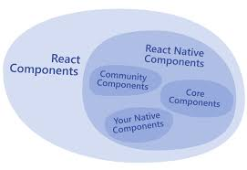

## Sesión 1: Introducción a React Native 🤖

### 1. Objetivos :dart: 

- Recordar las etiquetas de ReactJS. (JSX)
- Aprender las etiquetas de React Native y usarlas correctamente para los diferentes sistemas operativos.
- Explorar la creación de una app en React Native CLI y otra en Expo.

### 2. Contenido :blue_book:

React native te ayuda a utilizar un solo **_Code Base_** para crear los archivos necesarios para ambos sist4emas operativos.

React native promete ser el futuro de la programación móvil junto con otras tecnologías.

En este módulo aprenderemos:

- ¿Qué es react native?
- Componentes principales y nativos
- React native y ReactJS
- Usando nuestros primeros componentes

---

#### <ins>Tema 1: ¿Qué es react native?</ins>

**React Native** es un framework JavaScript creado originalmente por facebook para crear aplicaciones reales nativas para iOS y Android, basado en la librería de **JavaScript React** para la creación de componentes visuales, cambiando el propósito de los mismos para, en lugar de ser ejecutados en navegador, **correr directamente sobre las plataformas móviles nativa**s, en este caso iOS y Android. Es decir, en lugar de desarrollar una aplicación web híbrida o en HTML5, lo que obtienes como resultado es una **aplicación real nativa**, indistinguible de la que podrías desarrollar con tu código en Objective-C o Java.

---

 

#### <ins>Tema 2: Creando una app! (Con React native CLI)</ins>

Crear una app es muy sencillo con react native CLI, pasemos al Ejemplo 1

- [**`EJEMPLO 1`**](./Ejemplo-01)

---

 

#### <ins>Tema 3: Creando una app con Expo</ins>

Expo es un framework y una plataforma para aplicaciones universales de React. Es un conjunto de herramientas y servicios construidos alrededor de React Native y plataformas nativas que te ayudan a desarrollar, construir, implementar e iterar rápidamente en iOS, Android y aplicaciones web desde la misma base de código JavaScript / TypeScript.

- [**`EJEMPLO 2`**](./Ejemplo-02)

---

 

#### <ins>Tema 4: Usando nuestros primeros componentes</ins>

Basta del análisis, empecemos a usar los componentes que React native nos ofrece.

Empezaremos con el [Ejemplo-03](./Ejemplo-03) donde utilizaremos los componentes principales de React native.

Pongamos a prueba nuestros conocimientos adquiridos en nuestro [primer reto](./Reto-01) de este curso!

- [**`EJEMPLO 3`**](./Ejemplo-03)
- [**`RETO 1`**](./Reto-01)

---

### 3. Postwork :memo:

Encuentra las indicaciones y consejos para reflejar los avances de tu proyecto de este módulo.

- [**`POSTWORK SESIÓN 1`**](./Postwork/)

 

