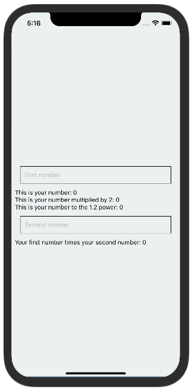

# Instrucciones

Para este reto crearás una app con una pantalla que tenga un `input`, donde el usuario teclee solamente numeros.
Con el número que el usuario ingrese vamos a hacer algunas operaciones matemáticas y las desplegaremos en la pantalla.
El espacio donde vamos a guardar el número del usuario empezará en cero `0`.

Se mostrara el número del usuario.
Se mostrará el número del usuario multiplicado por `2`.
Se mostrará el número elevado a la potencia `1.2`.

Además la app tendrá un segundo `input` donde el usuario podrá poner un segundo número.
Debajo de este segundo input mostraremos al usuario la multiplicación de los dos números que ingresó.

Aquí podemos apreciar como debe verse nuestra app. Recuerda que aún no vemos como darle estilo a nuestra aplicación así que no te preocupes mucho aún por como se ve actualmente nuestra app.

