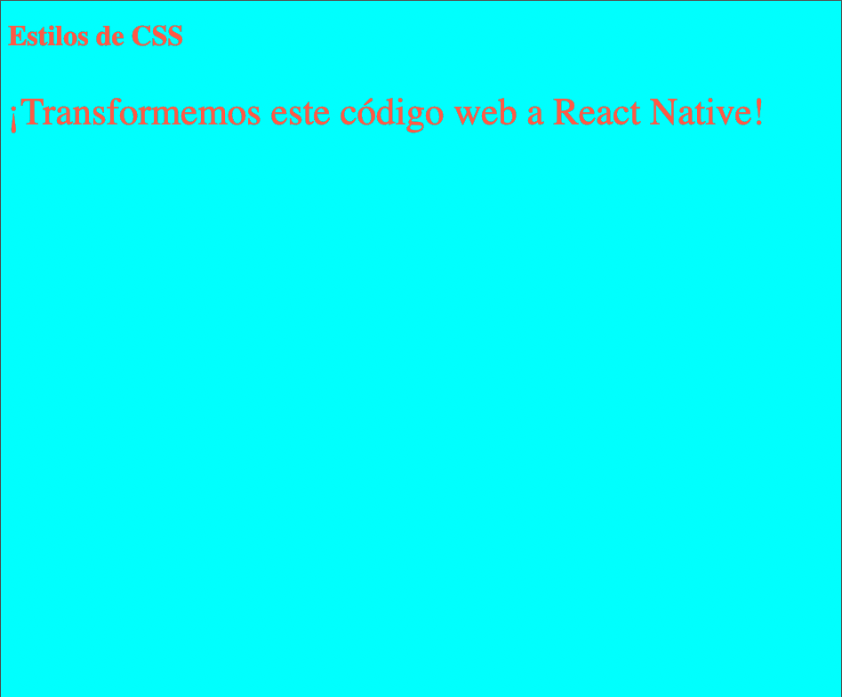

# Instrucciones

Transformaremos los estilos de CSS a estilos de React native Stylesheet.

```HTML
<!DOCTYPE html>
<html>
    <head>
    <style>
        body {
            background-color: cyan;
        }
        p {
        	font-size: 43px;
        }
    </style>
</head>
<body style="color:Tomato;">
  <h1>Estilos de CSS</h1>
  <p>¡Transformemos este código web a React Native!</p>
</body>
</html>
```

El snippet de código anterior se renderizaria en web de la siguiente manera:



La manera de hacer esto es identificar que en este código hay tres cosas importantes para React native:

- Un contenedor con un color de fondo customizado
- Un título con color rojo
- Un texto con tamaño específico y sobreescritura de color

Habiendo entendido esto pasemos a la solución... 