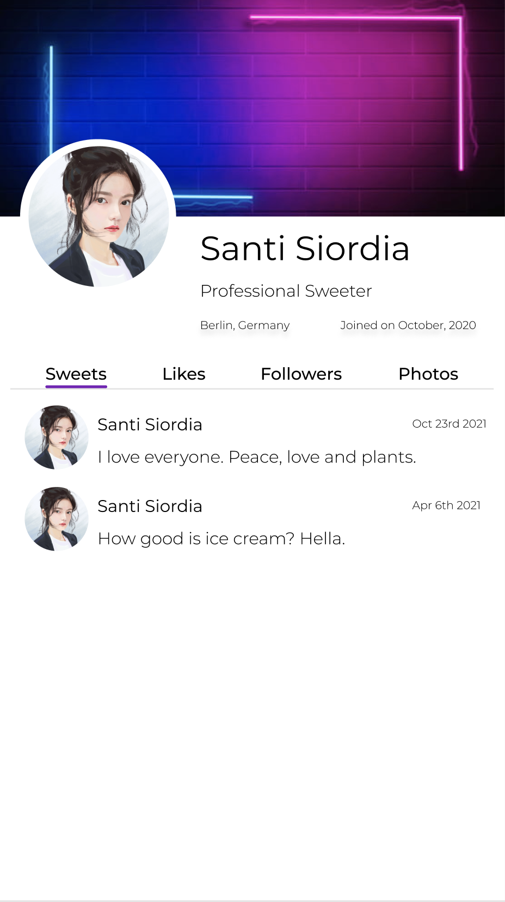
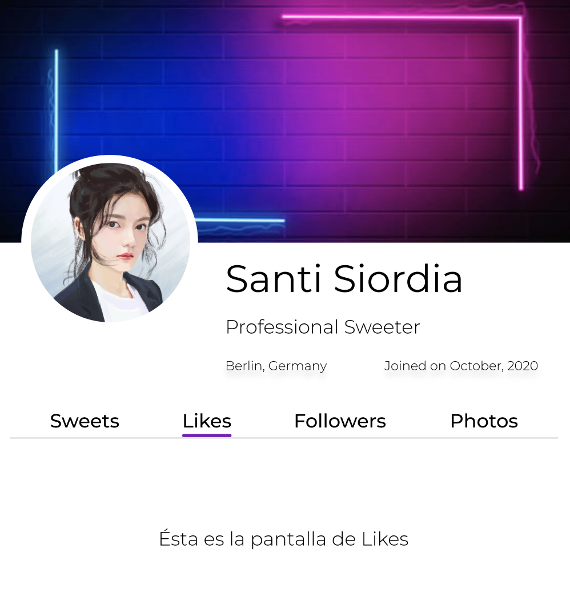
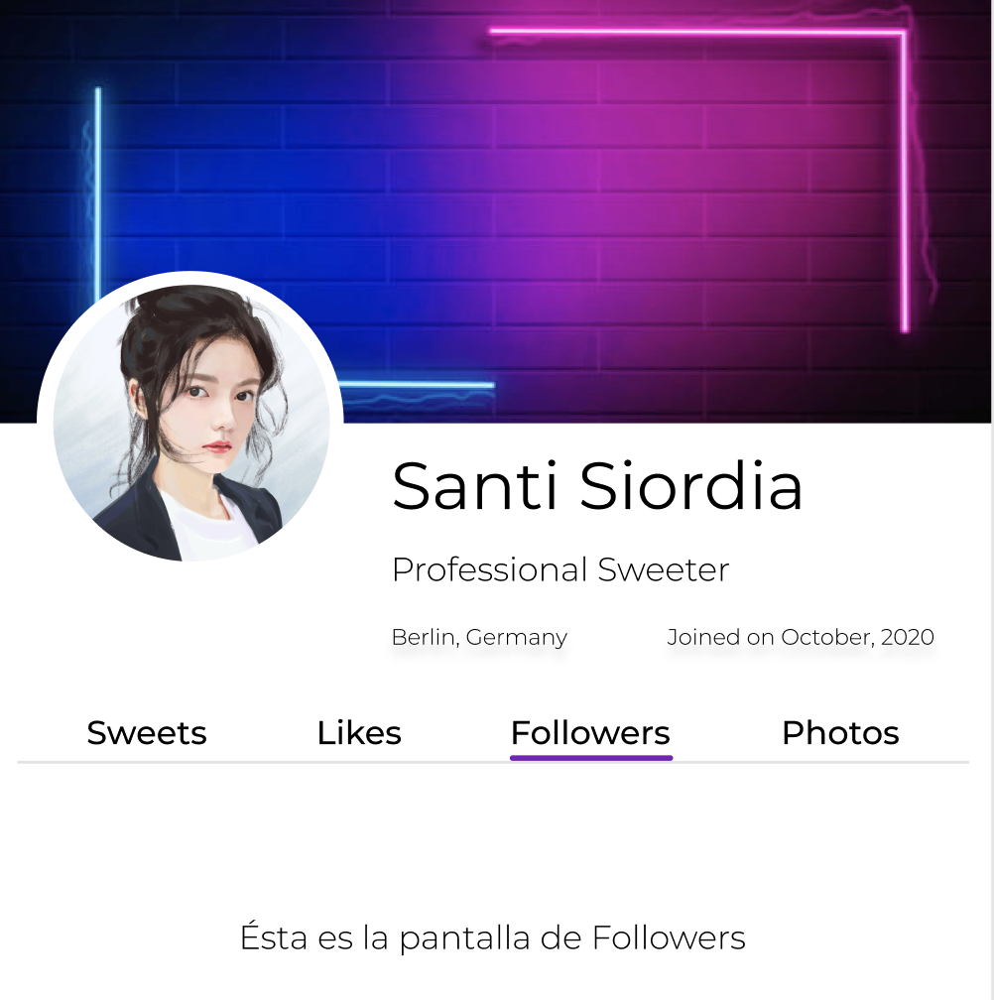
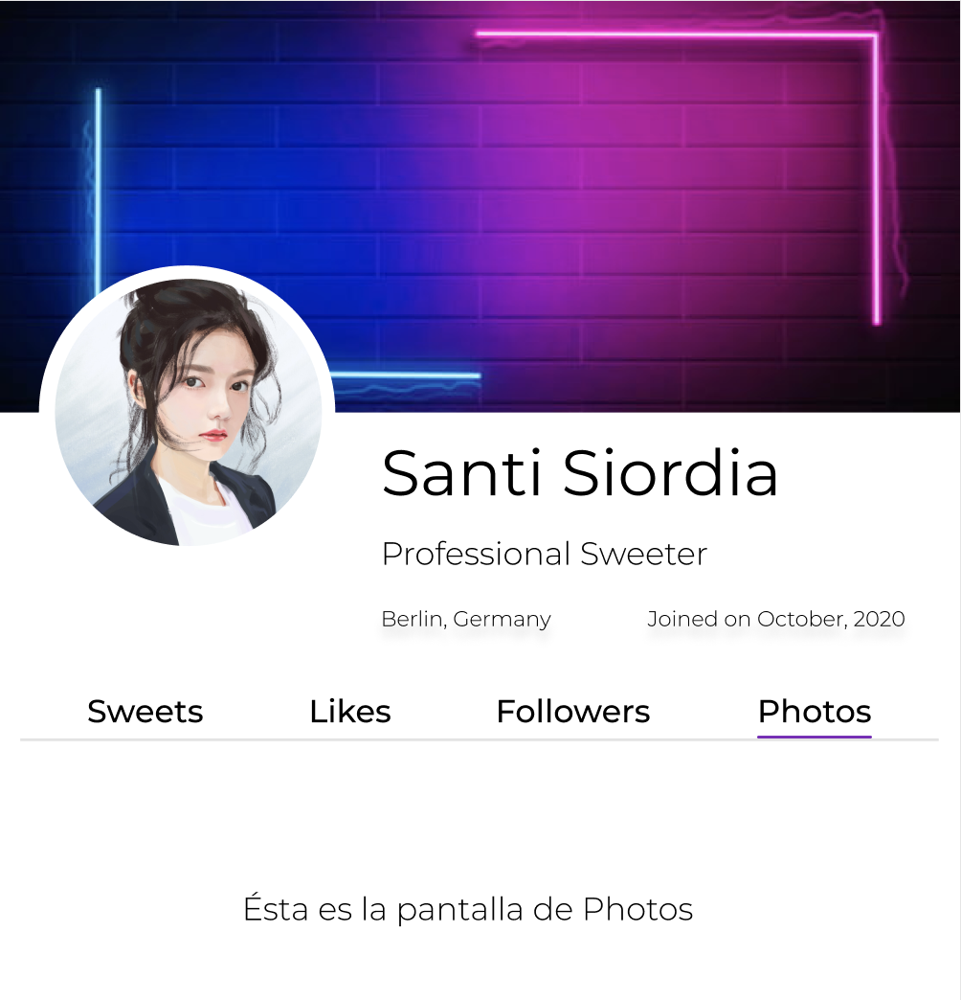

# Sesión 2: Componentes y estilos

## 🎯 Objetivos

- Comenzar el diseño la app que trabajarás hasta el final del curso.
- Diseñar el estilo de la app.
- Elegir la combinación de colores a utilizar.
- Crear la primera pantalla de tu aplicación.

## Desarrollo

En el prework y work has revisado varios elementos que tienen que ver con el diseño de una app móvil, apliquemos nuestro conocimiento en una nueva app. Esta app es una red social de nombre libre. Yo elegiré el nombré “Sweeter”, ¡estás invitado a elegir cualquier nombre que te parezca mejor!

La app debe ser creada mediante React Native CLI y usar TypeScript.
Debe tener renderización condicional para navegar entre componentes (Sweets, Likes, Followers y Photos)
Debes elegir una paleta diferente de colores a la de la app de ejemplo
Puedes hacer exactamente el diseño que te proponemos o puedes elegir alguno diferente, nos gusta la creatividad (:

### Imágenes de ejemplo

Como puedes apreciar, es una app muy parecida a **Twitter**. Pero **Sweeter** es una app que pretende esparcir amor y paz a diferencia de Twitter. Puedes elegir tu propia misión o quedarte con la que te proponemos, lo importante es que elijas bien ya que trabajaremos sobre esta app a lo largo del curso.

En la app puedes apreciar que hay una pequeña barra que pareciera un menú de navegación. Esto es obtenible con lógica condicional de renderizado.

En cada ítem del menú deberías renderizar algo diferente solo para hacer ver que de verdad se está cambiando el componente además de asegurarte que se marque bien la “pantalla” que está seleccionada, para que el usuario pueda ver en qué pantalla está actualmente.

**Nota:** Recuerda que no es necesario seguir al pie de la letra estás imágenes, estás más que invitado a hacer tu propio diseño y queremos que tengas libertad creativa en tu propia app. ¡Adelante y ánimo!
