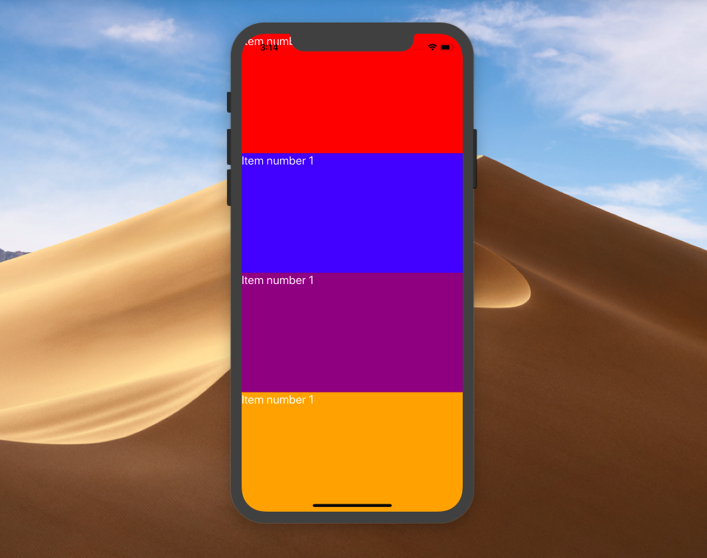
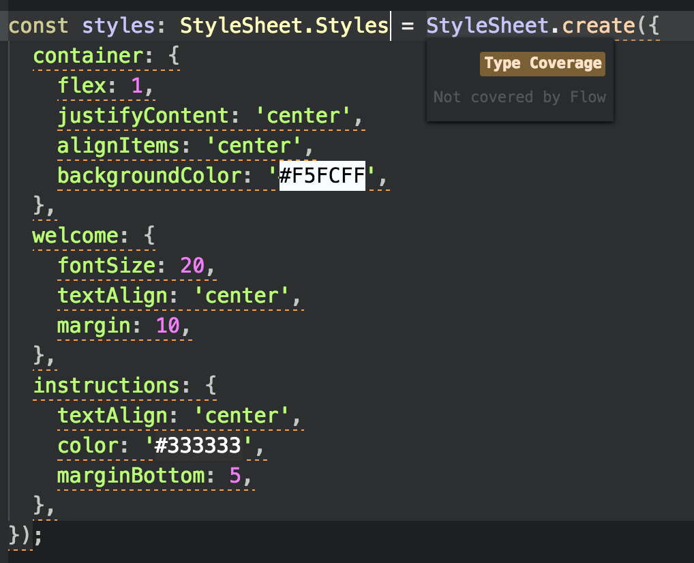
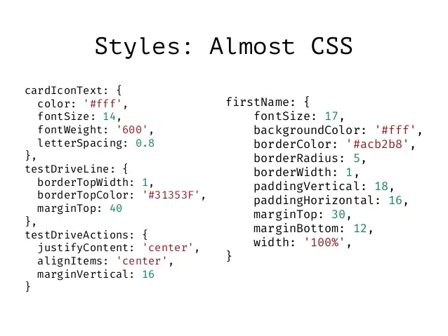

## Sesión 2: Componentes y estilos 🤖


<div style="text-align: justify;">

### 1. Objetivos 🎯

- Identificar las diferencias en estilos en React Native, comparandola con estilos en React JS.
- Diferenciar conceptos de estilo y componentes.
- Analizar la estructura y funcionalidad de un sistema de diseño.
- Crear nuestroprimer componente con estilo.

### 2. Contenido 📘

El estilo es una parte muy importante en React native. React native es básicamente una technología front end, el estilo, los layouts, el renderizado de imagenes y datos en general, las animaciones y todo lo que le importa al frontend de una aplicación le importa a React native. Así que vamos a conocerlo

---

 

#### <ins>StyleSheet</ins>

StyleSheet es una abstracción de lo que es una CSS StyleSheet


```JS
import React from "react";
import { StyleSheet, Text, View } from "react-native";

const App = () => (
  <View style={styles.container}>
    <Text style={styles.title}>React Native</Text>
  </View>
);

const styles = StyleSheet.create({
  container: {
    flex: 1,
    padding: 24,
    backgroundColor: "#eaeaea"
  },
  title: {
    marginTop: 16,
    paddingVertical: 8,
    borderWidth: 4,
    borderColor: "#20232a",
    borderRadius: 6,
    backgroundColor: "#61dafb",
    color: "#20232a",
    textAlign: "center",
    fontSize: 30,
    fontWeight: "bold"
  }
});

export default App;
```

Tips para la calidad del código:

- Al mover los estilos afuera de la función del componente haces el código más fácil de entender.
- Nombrar los estilos es una buena manera de agregar significado a los pequeños componentes.


- [**`EJEMPLO 1`**](./Ejemplo-01)

---

 

#### <ins>StyleSheet vs Objeto plano (plain object)</ins>

Hay algo muy importante que debemos aclarar aquí... ¿Hay difencia al usar `StyleSheet.create({ ...styleProps })` a solamente `{ ...styleProps }`?

Hay diferentes respuestas a esta pregunta... 

Un día otro desarrollador de react native un día me contó algo que para él era importante: 

*"Hay dos mitos bastante populares acerca de los beneficios de usar `StyleSheet.create`"*

##### ***Mito 1: `StyleSheet` tiene mejor desempeño***

*No hay absolutamente ninguna diferencia de rendimiento entre `StyleSheet` y un objeto declarado **fuera del render** (sería diferente si estás creando un nuevo objeto dentro del render cada vez). La diferencia de rendimiento es un mito.*

*El origen del mito probablemente se deba a que el equipo de **React Native** intentó hacer esto, pero no tuvo éxito. En ningún lugar de la [documentación oficial](https://reactnative.dev/docs/stylesheet), mientras que el [código fuente](https://github.com/facebook/react-native/blob/main/Libraries/StyleSheet/StyleSheet.js) menciona que la mejora de desempeño no está implementado:*

##### ***Mito 2: `StyleSheet` valida el objecto de estilos en tiempo de compilación (compile time).***

*Esto no es verdad. JavaScript puro no puede validar objectos en tiempo de compilación.*

- *Sí lo valida en tiempo de ejecución (Runtime), pero también lo hace cuando pasas un objeto de estilo a un componente. No hay diferencia*
- *Sí lo valida en tiempo de compilación (Compile time) **si estás usando Flow o TypeScript**, pero también lo hace cuando pasas el objecto plano como estilo en los props del componente, o si usas correctamente el **TypeHint** como lo podemos ver aquí:*

```JS
const containerStyle: ViewStyle = {
   ...viewStyleProps
}
```

Como desarrollador es importante entender que las opiniones no son algo en lo que te debas basar del todo para desarrollar tus propias aplicaciones.

Después de haberme dicho esto, decidí investigar en la documentación oficial de StylesSheet y ver si era verdad. Puede que el tuviera información antigua...

Lo que encontré fue un comentario hecho por los desarrolladores de [StylesSheet](https://github.com/facebook/react-native/blob/main/Libraries/StyleSheet/StyleSheet.js#L207):

```JS
/*
  * Code quality:
  * 
  *  - By moving styles away from the render function, you're making the code easier to understand.
  *  - Naming the styles is a good way to add meaning to the low level components in the render function.
  * 
  * Performance:
  * 
  *  - Making a stylesheet from a style object makes it possible to refer to it by ID instead of creating a new style object every time.
  *  - It also allows to send the style only once through the bridge. All subsequent uses are going to refer an id (not implemented yet).
*/
```

Este comentario explica que tiene beneficios en calidad de código y en desempeño.

---

 

#### <ins>CSS vs StyleSheet</ins>

Veamos esta imagen comparativa:



Como podemos apreciar, cada propiedad de estilo de StyleSheet es comparable a una propiedad identica en CSS, con la pequeña diferencia de que en StyleSheet se usa el `camelCase` para nombrar propiedades, de tal manera que la propiedad `background-color` de CSS es identica a `backgroundColor` de StyleSheet.

Pasemos a ver un [ejemplo](./Ejemplo-02) de como transormar CSS a StyleSheet.

Al terminar ese ejemplo, veamos algo mucho más complejo. Pasemos al [siguiente ejemplo](./Ejemplo-03).

- [**`Ejemplo 2`**](./Ejemplo-02)
- [**`Ejemplo 3`**](./Ejemplo-03)

---

### 3. Postwork :memo:

Encuentra las indicaciones y consejos para reflejar los avances de tu proyecto de este módulo.

- [**`POSTWORK SESIÓN 2`**](./Postwork/)


