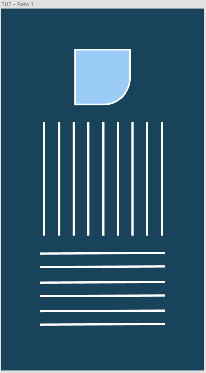

# Reto 1 - Experimentando estilos de StyleSheet

## Objetivo

- Experimentar los diferentes estilos que StyleSheet ofrece
- Obtener la libertad de crear diseños

## Desarrollo

En este reto deberemos crear una interfaz gráfica que sea atractiva para un usuario. No es necesario que esta interfaz gráfica tenga alguna funcionalidad, lo importante es que quedé muy parecida o "pixel perfect" al diseño que se propone, o puedes crear tu propio diseño con el mismo nivel de complejidad (aprobado por el experto).

El diseño de la interfaz es el siguiente:

> Imagen 1: Interfaz del reto

Podemos ver tres diferentes componentes en esta interfaz:

1. Una figura geométrica, parecida a un cuadrado pero una de sus esquinas tiene un border radius, el cuadrado tiene un stroke blanco de 3px y mide 100px de ancho por 100px de alto.
2. Una sección de líneas verticales, se repiten 9 veces y tienen una altura de 200px. Están separados el uno del otro por la misma distacia. Y abarcan el ancho del celular menos 70px.
3. Una sección de líneas horizontales, que toman todo el ancho de la pantalla del celular menos 70px. Hay seis líneas y están separadas de manera identica la una de la otra.

Puedes crear una nueva app para esto o usar una de las que ya tienes.

## Solución

Cuando ya tengas tu diseño listo, puedes compararlo con la [solución](./Solucion.md) que se propone.
