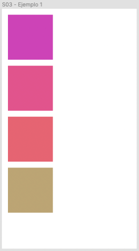

# Ejemplo 1 - Layout sencillo

## Objetivo

Tendremos dos objetivos:
- Desarrollar un layout sencillo.
- Entender propiedades por defecto de un flexbox.

## Desarrollo

Para lograr un layout complicado primero tenemos que entender las propiedades por defecto de un layout sencillo.

Queremos crear el siguiente layout en React Native:

Hay que tomar en cuenta cuatro cosas:

- El borde de la pantalla está separada de los recuadros por 16px.
- Cada recuadro entre ellos está separado por 16px.
- Cada recuadro mide 100px de ancho por 100px de alto.
- El arreglo de colores es el siguiente:

    `const colors = [ "#cc4bc2", "#dd5e98", "#e16f7c", "#c1ae7c"]`

¿Puedes obtener una pantalla similar antes de ver la solución?

Pasa a ver la [solución](./solucion.tsx).

Quisieramos aclarar que hay muchas maneras de conseguir lo mismo, si llegaste a algo diferente está bien, mientras se vea igual... pero, ¿usaste un método map? Esa es muy probablemente la manera más elegante de resolver este diseño de UI.

Veamos como lograrlo en el [ejemplo 2](../Ejemplo-02/README.md).
