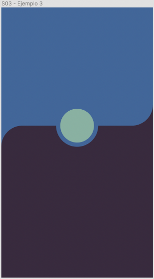

# Ejemplo 1 - Layout complejo

## Objetivo

Tendremos dos objetivos:
- Desarrollar un layout complejo.
- Modificar propiedades por defecto de un flexbox.

## Desarrollo

Veamos una posible solución a el siguiente UI móvil.

Ya tenemos una idea de lo que tenemos que hacer...

### Una lista de componentes que podemos ver en la pantall

1. Un fondo azul (#5171A5).
2. La mitad de la pantalla es de otro tono de azul. (#3F3047) Este componente tiene border radius. (50px)
3. Tenemos un círculo (100px de diamtero, color #98B9AB) justo al centro horizontal de donde se juntan nuestros dos colores azules. Este círculo además tiene un stroke (10px).

Además hay un posible objeto del cual podemos no tener idea de como hacer. ¿Puedes identificar qué nos falta en la lista?

Veamos que podemos hacer en la [solución de este ejemplo](./solucion.tsx).
