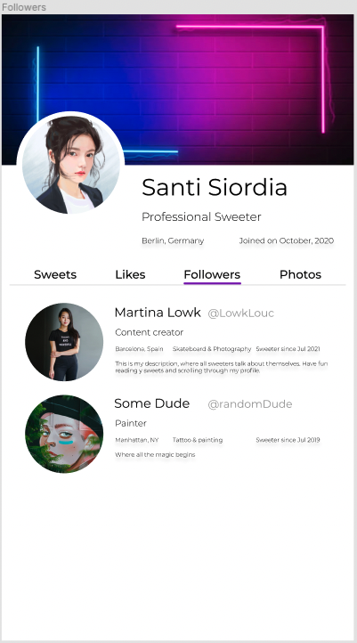
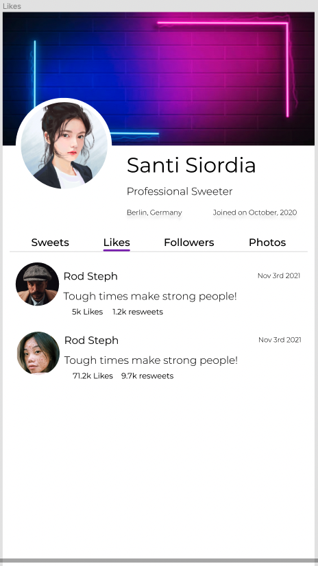

# Postwork

Para este postwork, aplicaremos las habilidades que hemos aprendido de Layouts.

Tomemos en cuenta las siguientes imagenes:

Tenemos que completar en nuestra app estos Layouts, recuerda que hemos estado trabajando en una app desde la Sesión 2.

Sobre esa misma haremos nuestro siguiente postwork.

Hay dos imagenes a las que tenemos que prestarle mucha atención, la pantalla que muestra todas las fotos de nuestro perfil tiene dos Layouts, un Layout que es default, con 3 columnas de fotos, y otra que tiene 4 columnas, es importante que solo pasando un prop `numberOfColumns` al componente que aloja esta galería, el componente pueda renderizar las columnas de imagenes que nosotros queramos para nuestro propio perfil.

¿Estás imagenes de aquí parecen muy básicas en Layout? Pues es verdad, en el work vimos cosas muy complejas de Layouts, es por eso que ahora todo parece sencillo, tiene mucha funcionalidad y poco Layout, es por eso que te presentamos este reto de diseño para la galería también.

Nos gustaría que diseñaras algún layout llamativo para simplemente ponerlo detras de las imagenes que renderizaremos detrás de las imagenes:

Aquí tenemos un ejemplo:

Lo acomodaremos detrás de la galería de esta manera:

