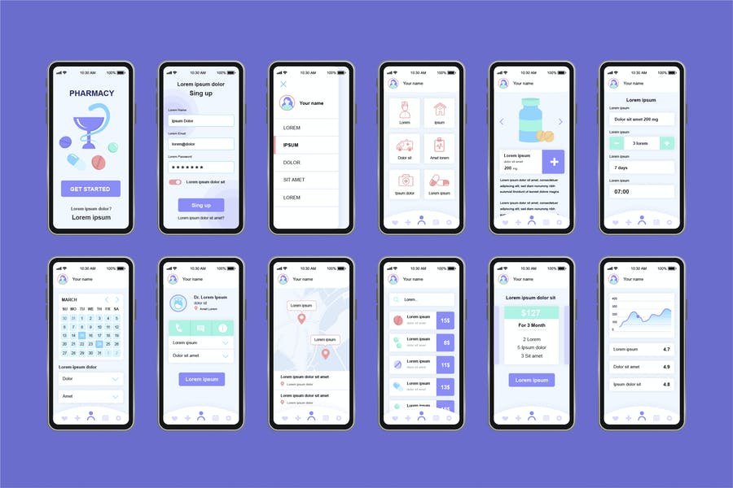
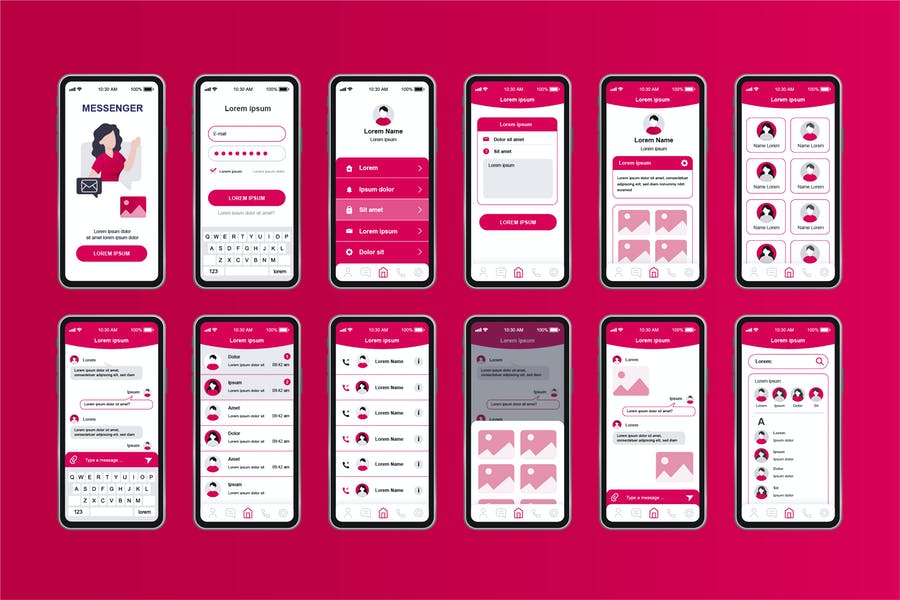

## Sesión 3: Layouts, responsividad y adaptabilidad de UI 🤖

### 1. Objetivos 🎯

- Comprender para que sirven todas las propiedades del Layout
- Adaptar diseños complejos a nuestros componentes
- Aplicar la teoría de Yoga Layout en nuestras apps

## 2. Contenido 📘

Es hora de hablar de diseños más complejos para nuestras apps, no nos podemos quedar con layouts simples si queremos hacer una app excepcional. En este módulo veremos lo sencillo que es hacer que cualquier Layout se vea simple. 

---
#### <ins>Tema 1: ¿Qué es Layout?</ins>

El Layout es aveces llamado en español "Maquetación". Se refiere a un esquema de distribución de los elementos dentro de un diseño.

En nuestro caso, los elementos con nuestros componentes.

Algunos ejemplos de diferentes distribuciones de elementos pueden verse en la siguiente imagen:

---

#### <ins>Tema 2: Ejercitando Layouts</ins>

Es hora de practicar un poco como hacer Layouts personalizados para las apps que queramos nosotros.

Vayamos a nuestro [primer ejemplo](./Ejemplo-01).

Veamos como optimizar un poco de líneas de código en el [segundo ejemplo](./Ejemplo-02).

- [**`EJEMPLO 1`**](./Ejemplo-01)
- [**`EJEMPLO 2`**](./Ejemplo-02)
---

#### <ins>Tema 3: Layouts complejos</ins>

Ya entendimos las propiedades por defecto de un layout. Ahora veamos que tenemos que modificar para que se vea de las maneras que queramos.

Analizemos el [ejemplo 3](./Ejemplo-03).

- [**`EJEMPLO 3`**](./Ejemplo-03)
---

#### <ins>Tema 4: ¿Sabemos de Layouts?</ins>

¿Crees estar listo para aplicar lo que aprendimos aquí? Sabes que cuando tengas dudas puedes preguntarnos lo que quieras... ¿Pero sabes que habilidad es importante en cualquier Programador? saber buscar en la documentación oficial de la tecnología de la que está aprendiendo. Es una cualidad que no se adquiere fácil, lo prometemos, lleva mucho trabajo por detrás y es normal preguntar cuando no encuentras alguna respuesta.

Habiendo dicho eso, vayamos a nuestro [primer reto](./Reto-01).

- [**`Reto 1`**](./Reto-01)

---

### 3. Postwork :memo:

Encuentra las indicaciones y consejos para reflejar los avances de tu proyecto de este módulo.

- [**`POSTWORK SESIÓN 3`**](./Postwork/)

 

