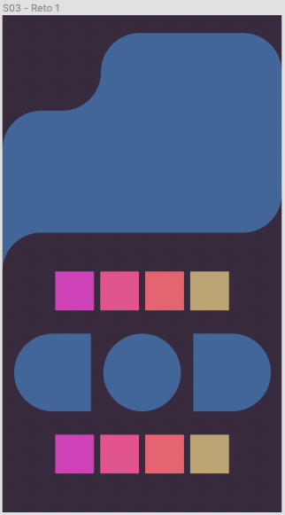

# Reto 1 - Layouts complejos

## Objetivo

- Aplicar Layouts absolutos
- Comprender qué es necesario para crear un layout aparentemente complejo

## Desarrollo

Para este reto, intentaremos replicar el Layout que dicta la siguiente imagen de UI

¿Parece muy complejo no? Por suerte, ya tenemos un poco de este UI empezado en el [ejemplo 3](../Ejemplo-03).

Intenta que tu diseño sea lo más parecido posible a esta imagen. No veas la solución hasta que te sientas seguro de tu resultado o de verdad ya no puedas hacer nada más.

Debemos aceptar que es un reto bastante complejo. ¡Pero imposible no es, Ánimo!

Aquí dejamos la [solución](./solucion.tsx).