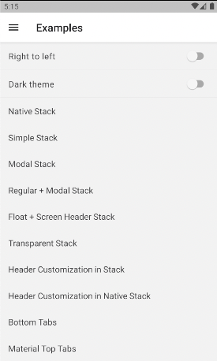

# Ejemplo 1 - Alcance de la navegación.

## Objetivo

- Entender lo que se puede hacer en react native cuando de trata de navegación.
- Correr el ejemplo que la librería de navegación nos ofrece

## Desarrollo

Dirígete al [repositorio de GitHub de React navigation](https://github.com/react-navigation/react-navigation/tree/main/example), seguiremos las instrucciones que mecionan aquí, pero también las pondremos aquí por si hay algun problema en la documentación oficial en el futuro.

Donde vayamos a poner el proyecto de ejemplo corremos el siguiente comando para clonar el proyecto:

```shell
git clone git@github.com:react-navigation/react-navigation.git
```

Después corre

```shell
cd react-navigation && yarn && cd example && yarn start
```

Tendrás el metro bundler trabajando, a partir de aquí puedes construir la app en el emulador android o iOS.
Aségurate de tener el emulador y/o simulador corriendo cuando corras el siguiente comando:

Para android debes correr

```shell
yarn android
```

Y para iOS debes correr

```shell
cd ios && pod install && cd .. && yarn ios
```

Veremos que el ejemplo ya estará corriendo en nuestros emuladores y simuladores.

Debería verse de la siguiente manera:



Exploremos que hay por aquí.
