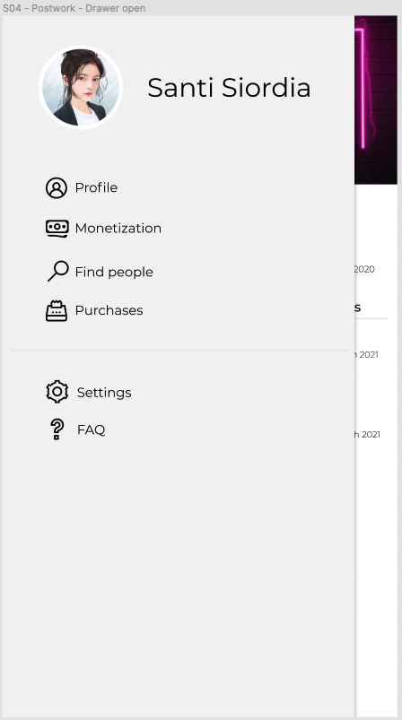
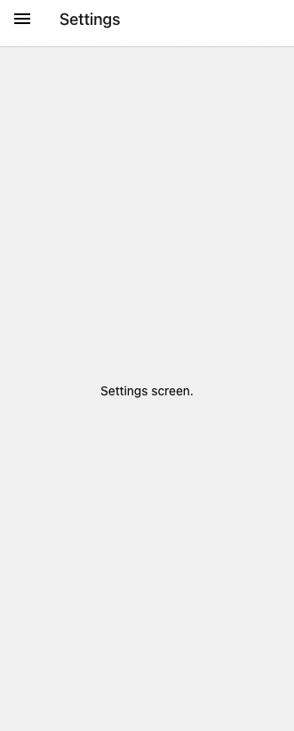
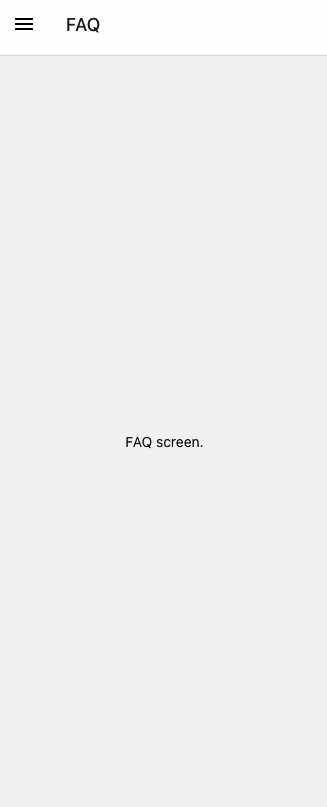

# Sesión 4: 

## :dart: Objetivos

- Implementar navegación de cajón (Drawer navigation)en tu app.
- Navegar entre diferentes pantallas.

## Desarrollo

- Instala  la librería de navegación corriendo el comando:
- 
```bash
yarn add @react-navigation/native react-native-screens react-native-safe-area-context
```

- Instala el paquete de navegación de cajón:
- 
```bash
yarn add @react-navigation/drawer
```

- Agrega un feature a tu app Sweeter.




> Imagen 1 y 2. Cajón cerrado y abierto.

- En las imágenes anteriores puedes apreciar dos cosas:

    - Imagen 1: La app ahora tiene un “header” que por el momento solo incluye un ícono y actúa como botón para abrir el cajón de navegación
    - Imagen 2: Se abre un cajón de navegación con varias pantallas. Cada vez que se hace clic en cualquier texto del cajón o cualquier ícono, se navega a una nueva pantalla.

- Las nuevas pantallas que agregaste no tienen que tener algún diseño complicado o específico, los objetivo de este postwork son:

    - Hacer que la navegación sea funcional, 
    - Que existan todas las pantallas que has puesto en el cajón de navegación y 
    - Que el usuario sepa muy bien en qué pantalla está situado. 

Te daremos una idea ejemplo de cómo pueden lucir dos pantallas diferentes:




> Imagen 3 y 4. Pantallas de Settings y FAQ

Cada una de estas pantallas debe pertenecer a un archivo diferente, debe existir como componente aislado y también tendrás que crear un header personalizado, usarás el header por defecto que da la librería de navegación de cajón. Puedes ver una idea de la UI de sugerencia de header en la Imagen 1. Puedes diseñar un header diferente si así lo deseas. 

Asegúrate de instalar en tu app una librería de íconos de tu elección. Eres libre de elegir el estilo de los mismos
