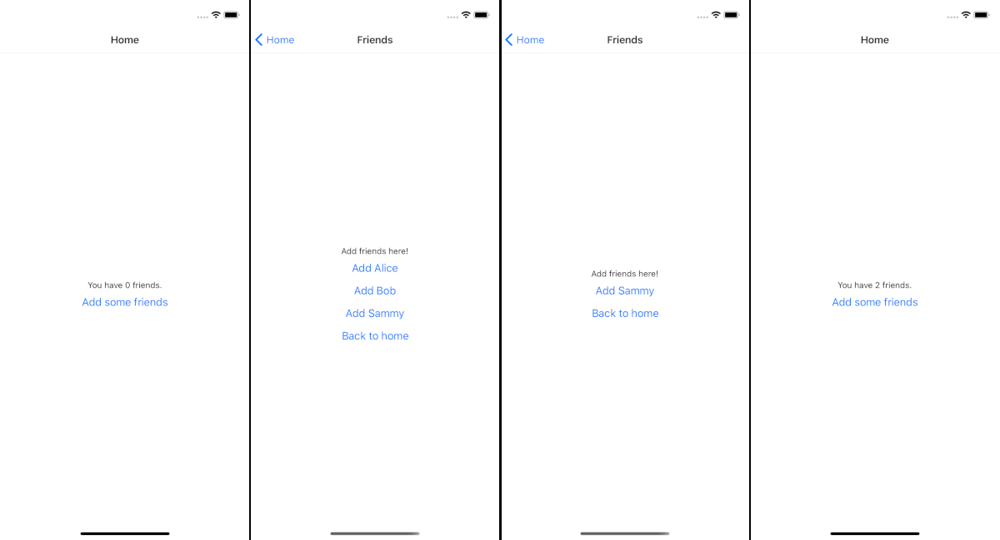

# Ejemplo 2 - Usando Redux en React native

## Objetivo

* Agregar Redux en una app de react native
* Entender experimentalmente como usar Redux
## Desarrollo

Dividamos este proceso en pasos

**Paso 1: Configurar nuestro entorno**

Deberemos correr el siguiente comando:

```bash
git clone https://github.com/do-community/MySocialNetwork.git && cd MySocialNetwork && git checkout redux-starter && npm install && npm install && npm install redux@4.0.5 react-redux@7.2.1
```

Para ios: 

```bash
cd ios && pod install && cd ..
```

**Paso 2: Crear un reductor**

Para esto deberemos crear un archivo nuevo en el root de nuestro proyecto

```bash
nano FriendsReducer.js
```

Y esto es lo que agregaremos a nuestro archivo:

```JS
import { combineReducers } from 'redux';

const INITIAL_STATE = {
  current: [],
  possible: [
    'Alice',
    'Bob',
    'Sammy',
  ],
};

const friendsReducer = (state = INITIAL_STATE, action) => {
  switch (action.type) {
    default:
      return state
  }
};

export default combineReducers({
  friends: friendsReducer
});
```

En este archivo creamos un estado inicial (INITIAL_STATE) con posibles amigos para agregar a nuestra red social. Después exportamos el friendsReducer como una propiedad llamada `friends`.

Con nuestro reducer hecho, necesitamos una manera de agregar amigos.

**Paso 3: Crear una acción**

Crearemos un nuevo archivo llamado `FriendsActions.js` 

```bash
nano FriendsActions.js
```

Agregaremos una función que se llame `addFriend`

```JS
export const addFriend = friendsIndex => (
  {
    type: 'ADD_FRIEND',
    payload: friendsIndex,
  }
);
```

Cuando un usuario presione sobre un amigo, este código va a traer el friendIndex del arreglo de `friends.possible`. Y ahora usaremos este indice para mover a este amigo dentro del arreglo `friends.current`.

Revisitaremos `FriendsReducer.js`:

```bash
nano FriendsReducer.js
```

Y ahora nuestro reductor debería verse de la siguiente manera

```JS
//...

const friendsReducer = (state = INITIAL_STATE, action) => {
  switch (action.type) {
    case 'ADD_FRIEND':
      // Toma current y possible del estado anterior
      // No queremos alterar el estado directamente en caso
      // de que otra acción esté ya alterandolo al mismo tiempo
      const {
        current,
        possible,
      } = state;

      // Agarramos a un amigo de friends.possible
      // Toma en cuenta que action.payload === friendIndex
      const addedFriend = possible.splice(action.payload, 1);

      // Ponemos al amigo en friends.current
      current.push(addedFriend);

      // Finalmente actualizamos el estado de redux
      const newState = { current, possible };

      return newState;

    default:
      return state
  }
};

// ...
```

Este código obtiene los amigos `current` y `possible` del estado anterior. El `Array.splice()` obtiene el amigo desde el arreglo de posibles amigos. El `Array.push()` agrega al amigo al arreglo de amigos actuales. Después de que los cambios son hechos, el estado es actualizado.

Ahora tenemos un reductor con una acción. Necesitaremos aplicar el reductor a nuestra app.

**Paso 4: Agregando el Reducer a la App**

Necesitamos proveer el estado de amigos a nuestra app usando el componente `Provider`.

Abriremos App.js:

```bash
nano App.js
```

Importaremos Provider, createStore, y friendsReducer:

En App.js:

```JS
import 'react-native-gesture-handler';
import React from 'react';
import { Provider } from 'react-redux';
import { createStore } from 'redux';
import { StyleSheet } from 'react-native';
import { NavigationContainer } from '@react-navigation/native';
import { createStackNavigator } from '@react-navigation/stack';
import friendsReducer from './FriendsReducer';
import HomeScreen from './HomeScreen';
import FriendsScreen from './FriendsScreen';

// ...
```
 
Add and replace the highlighted code with createStore and Provider:
Agregamos las siguientes líneas de código en `App.js`.

```JS
// ...

const store = createStore(friendsReducer);

class App extends React.Component {
  // ...

  render() {
    return (
      <Provider store={store}>
        <NavigationContainer>
          <Stack.Navigator>
            <Stack.Screen
              name="Home"
              component={HomeScreen}
            />
            <Stack.Screen
              name="Friends"
              component={FriendsScreen}
            />
          </Stack.Navigator>
        </NavigationContainer>
      </Provider>
    )
  }
}
```

Now friends are accessible within your app, but you still need to add them to the HomeScreen and FriendsScreen.

Ahora `friends` es accesible desde nuestra app, pero aun necesitamos agregarlos al `HomeScreen` y a `FriendsScreen`.

**Paso 5: Agregando Redux a las pantallas**

En este paso, haremos accesible `friends` a las pantallas con el con la función `mapStateToProps`. Esta función mapea el estado de `FriendsReducer` a las props en las dos pantallas

Let’s start with HomeScreen.js. Open the HomeScreen.js file:
Empecemos con `HomeScreen.js`. 

```JS
nano HomeScreen.js
```

Y modificaremos el código de esta manera.

```JS
import React from 'react';
import { connect } from 'react-redux';
import { StyleSheet, Text, View, Button } from 'react-native';

const HomeScreen = () => {
    return (
        <View style={styles.container}>
            <Text>You have (undefined) friends.</Text>

            <Button
                title="Add some friends"
                onPress={() =>
                    this.props.navigation.navigate('Friends')
                }
            />
        </View>
    );
}

const styles = StyleSheet.create({
  container: {
    flex: 1,
    backgroundColor: '#fff',
    alignItems: 'center',
    justifyContent: 'center',
  },
});

const mapStateToProps = (state) => {
  const { friends } = state
  return { friends }
};

export default connect(mapStateToProps)(HomeScreen);
```
 
Este código agrega `react-redux` y hace a `friends` estar disponible en `HomeScreen`.

Como siguiente paso, agregaremos valores para `current friends`.

```JS
const HomeScreen = (props) => {
    return (
        <View style={styles.container}>
        <Text>You have { props.friends.current.length } friends.</Text>

        <Button
            title="Add some friends"
            onPress={() =>
                props.navigation.navigate('Friends')
            }
        />
        </View>
    );
}
```
 
Nuestro `HomeScreen` ahora se renderizara con el número actual de amigos. Podemos ahora trabajar en `FriendsScreen`.

Abriremos FriendsScreen.js:

```JS
nano FriendsScreen.js
```

Y modificaremos el código de esta manera

```JS
import React from 'react';
import { connect } from 'react-redux';
import { StyleSheet, Text, View, Button } from 'react-native';

const FriendsScreen = props => {
    return (
        <View style={styles.container}>
            <Text>Add friends here!</Text>

            <Button
                title="Back to home"
                onPress={() =>
                    props.navigation.navigate('Home')
                }
            />
        </View>
    );
}

const styles = StyleSheet.create({
  container: {
    flex: 1,
    backgroundColor: '#fff',
    alignItems: 'center',
    justifyContent: 'center',
  },
});

const mapStateToProps = (state) => {
  const { friends } = state
  return { friends }
};

export default connect(mapStateToProps)(FriendsScreen);
```

Este cambio en el código agrega `react-redux` y hace a `friends` disponible en la pantalla de `FriendsScreen`.

Agregaremos valores para posibles amigos(props.friends.possible):

```JS
const FriendsScreen = props => {
    return (
        <View style={styles.container}>
            <Text>Add friends here!</Text>

            {
                props.friends.possible.map((friend, index) => (
                    <Button
                        key={ friend }
                        title={ `Add ${ friend }` }
                    />
                ))
            }

            <Button
                title="Back to home"
                onPress={() =>
                    props.navigation.navigate('Home')
                }
            />
        </View>
    );
}
```

Ahora cuando naveguemos a `FriendsScreen`, vamos a ver todos los posibles amigos desde el reductor.

Finalmente, agregaremos la nueva acción de Redux `addFriend` a la pantalla de `FriendsScreen`:

```JS
const FriendsScreen = props => {
    return (
        <View style={styles.container}>
            <Text>Add friends here!</Text>

            {
                props.friends.possible.map((friend, index) => (
                    <Button
                    key={ friend }
                    title={ `Add ${ friend }` }
                    onPress={() =>
                        props.addFriend(index)
                    }
                    />
                ))
            }

            <Button
            title="Back to home"
            onPress={() =>
                props.navigation.navigate('Home')
            }
            />
        </View>
    );
}

// ...

const mapDispatchToProps = dispatch => (
  bindActionCreators({
    addFriend,
  }, dispatch)
);

export default connect(mapStateToProps, mapDispatchToProps)(FriendsScreen);
```

Agregemos a dos amigos a la red social y navegar de vuelta a `HomeScreen` para ver cuantos amigos tiene actualmente el usuario:



Con eso, hemos movido toda la lógica de `App.js` a Redux, lo cual hace que nuestra app sea más flexible, especialmente mientras más pantallas y características como autenticación e integración con bases de datos.

Antes de terminar, hay que limpiar el código.

**Paso 6: Limpiando el código**

Ahora que usamos Redux, no necesitamos los props que le pasabamos a `App.js`

Podemos llevar el proceso de limpieza más allá al almacenar nuestros tipos de acciones en un archivo separado.

Estamos usando el `string 'ADD_FRIEND'` en dos lugares: en la acción y en el reductor de `friends`. Esto es peligroso, porque si cambias el `string` en un lugar y no en el otro, romperemos la app. A medida que nuestra app crezca, hace sentido mantener todos estos tipos de acciones en un archivo que se llame `types.js`. 

Crearemos el archivo `types.js` en root level:

```bash
nano types.js
```

Y agregaremos el siguiente código:

```JS
export const ADD_FRIEND = 'ADD_FRIEND';
```

Refactorizaremos `FriendsActions.js`:

```bash
nano FriendsActions.js
```

Agregaremos esto:

```JS
import { ADD_FRIEND } from './types';

export const addFriend = friendsIndex => (
  {
    type: ADD_FRIEND,
    payload: friendsIndex,
  }
);
```

Luego, revisitaremos `FriendsReducer.js` para agregar el nuevo `ADD_FRIEND`:

```bash
nano FriendsReducer.js
```

Cambiamos `'ADD_FRIEND'` por la variable `ADD_FRIEND` en nuestro reductor:

```JS
import { combineReducers } from 'redux';
import { ADD_FRIEND } from './types';

// ...

const friendsReducer = (state = INITIAL_STATE, action) => {
  switch (action.type) {
    case ADD_FRIEND:
      // ...

    default:
      return state;
  }
};
```

Esto hace que nuestra app no sea tan fragil. Cuando desarrollamos apliciones, debemos de estar al tanto de oportunidades para solidificar nuestro código y evitar repetir cosas.

## Resumen

En este largo ejemplo cubrimos  Redux, Reductores y acciones, para el manejo correcto de escalabilidad de datos.