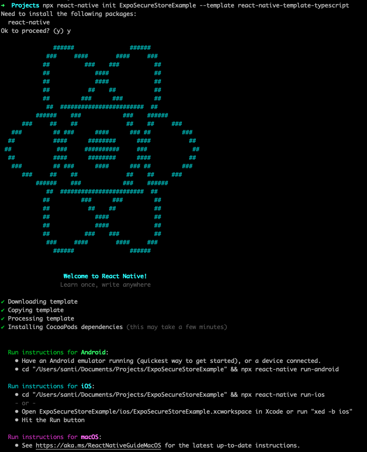
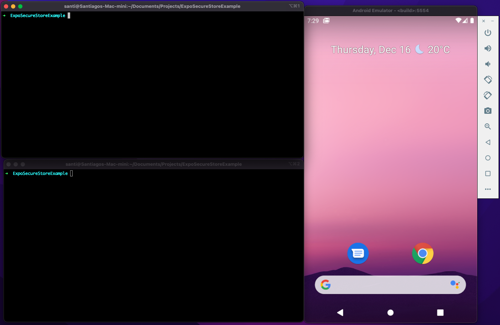
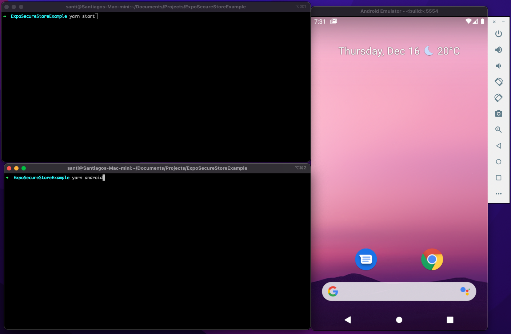
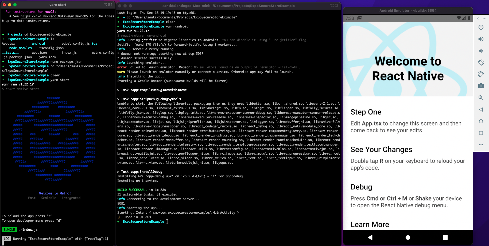
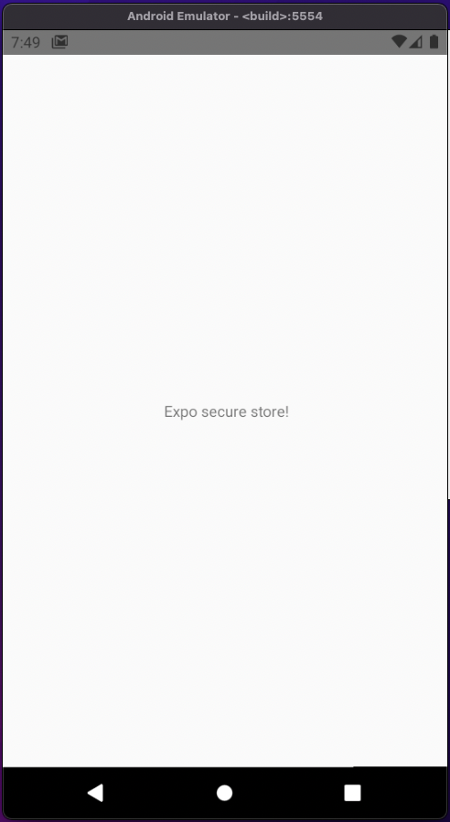
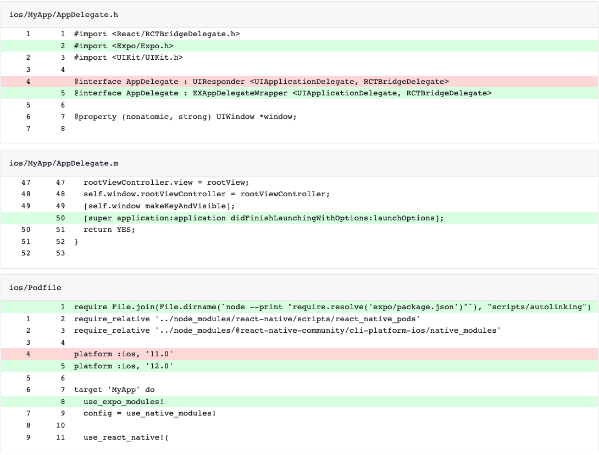
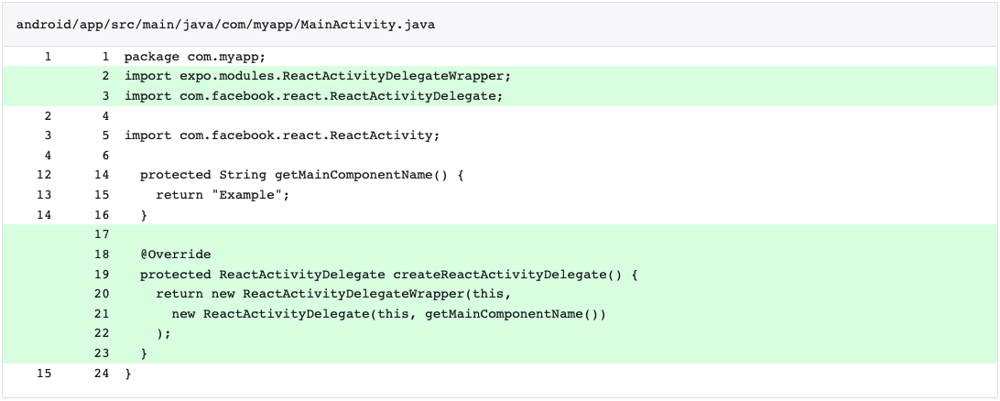
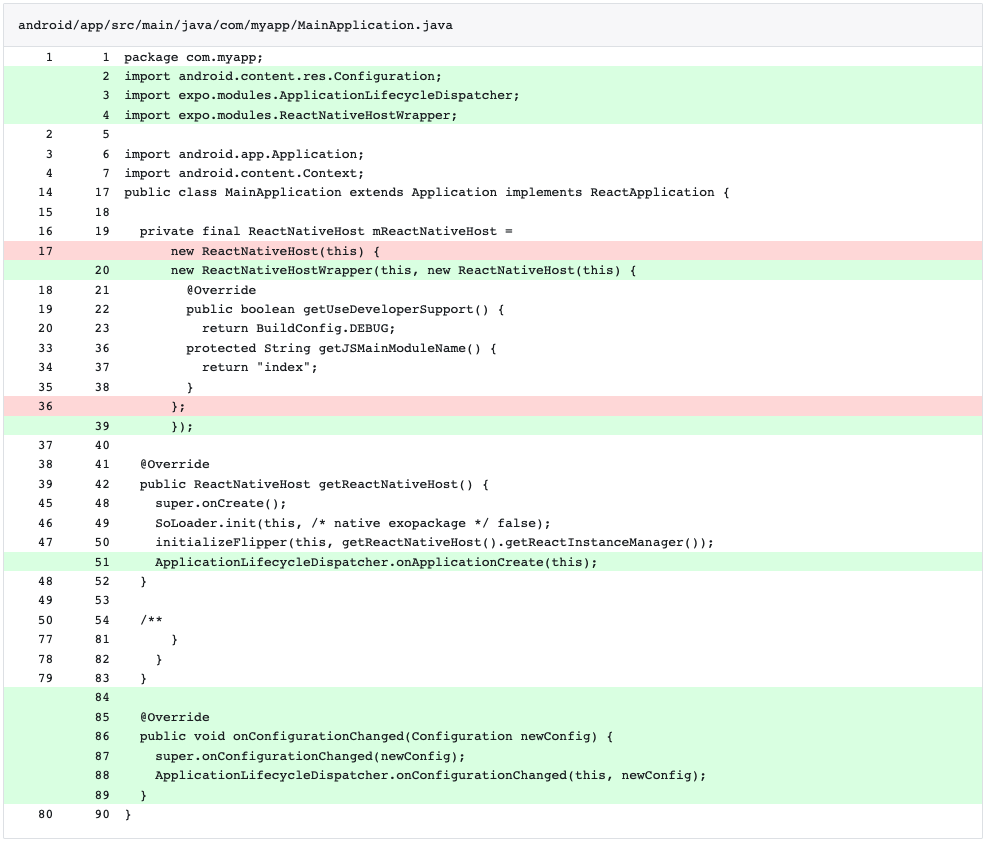
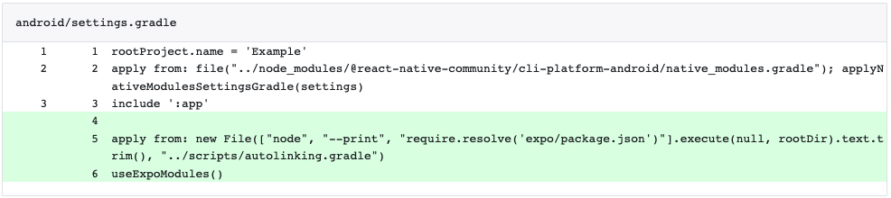
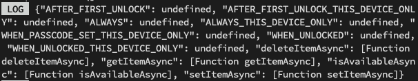

# Ejemplo 3 - Secure store

Vamos a instalar y a usar esta librería en un proyecto propio de react native.

## Creando la app

Debemos correr el comando apropiado para crear la app

`npx react-native init ExpoSecureStoreExample --template react-native-template-typescript`



## Correr la app

Sabemos que después de crear la app tenemos que correrla en algún emulador, aquí usaremos android para este ejemplo. Debemos tener un emulador de android corriendo y dos terminales abiertas en la misma ubicación: el folder que se acaba de crear.

Para ir a este folder en la misma terminal en la que creamos la app, debemos ejecutar `cd ExpoSecureStoreExample`.

En una terminal ejecutamos `yarn start` y en la segunda terminal ejecutamos `yarn android`.




Recordemos que tarda un rato construyendo la app para android, también tarda en construir para iOS. Pero una vez que haya terminado,



## Reemplazamos el contenido de `App.tsx`

Ingresemos esto a nuestro archivo:

```TSX
import React from 'react';
import { StyleSheet, Text, View } from 'react-native';

const App = () => {
  return (
    <View style={styles.container}>
      <Text> Expo secure store!</Text>
    </View>
  );
};

const styles = StyleSheet.create({
  container: {
    flex: 1,
    alignItems: 'center',
    justifyContent: 'center',
  },
});

export default App;
```

La app ahora debería verse así:



Ahora instalemos expo secure store.

## Instalando secure-store

Ejecutamos el siguiente comando

```bash
npx install-expo-modules
```

### Si falla la instalación de secure-store

Ejecturemos el siguiente comando:

```bash
yarn add expo
```

**Haremos manualmente los siguientes cambios para ios:**



Ejecutamos `npx pod-install`

**Haremos manualmente los siguientes cambios para android:**





## Instalando librería

Correremos el siguiente comando para instalar esta librería, ya que `expo` es quien maneja la librería, la añadiremos desde el comando `expo`.

```bash
expo install expo-secure-store
```
### Verificando que funciona la instalación.

Podemos pegar el siguiente código en nuestra App, veamos si logea bien los resultados a la consola.

```TS

import * as SecureStore from 'expo-secure-store';
console.log(SecureStore);

```

Nos saldrá un log parecido a este:



Analizemóslo un poco:

```JSON
{
  "AFTER_FIRST_UNLOCK": undefined,
  "AFTER_FIRST_UNLOCK_THIS_DEVICE_ONLY": undefined,
  "ALWAYS": undefined,
  "ALWAYS_THIS_DEVICE_ONLY": undefined,
  "WHEN_PASSCODE_SET_THIS_DEVICE_ONLY": undefined,
  "WHEN_UNLOCKED": undefined,
  "WHEN_UNLOCKED_THIS_DEVICE_ONLY": undefined,
  "deleteItemAsync": [Function deleteItemAsync],
  "getItemAsync": [Function getItemAsync],
  "isAvailableAsync": [Function isAvailableAsync],
  "setItemAsync": [Function setItemAsync]
}
```

Este objeto representa todas las utilidades que tiene `SecureStore` como librería.

Los métodos que se pueden distiguir facilmente porque tienen asignado un objeto función:

Ejemplo: `"getItemAsync": [Function getItemAsync]`.

Recordemos que cuando imprimimos una funcion en `JS` sin llamarla, lo que se loggea a la consola es `[Function nameOfTheFunction]`.

¿Qué podemos hacer con esta librería?

Veámoslo en el siguiente [reto](../Reto-01/).