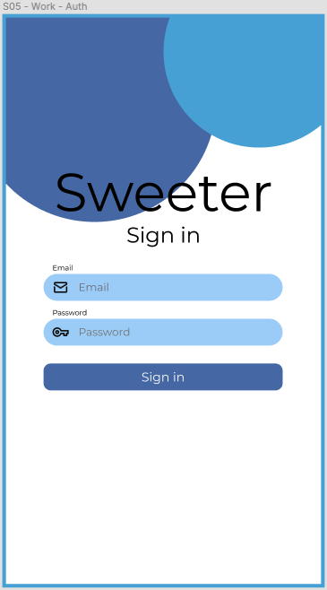
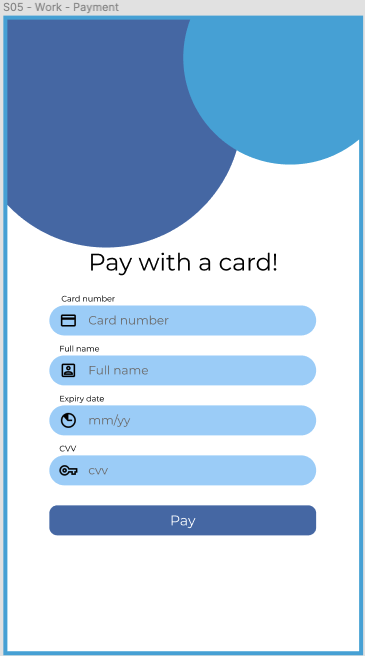

# Reto 01 - Secure Store

## Objetivo

Pongamos en práctica lo que podemos hacer con Expo Secure Store.

## Desarrollo

En este reto usaremos la app que creamos en el [Ejemplo 04](./../Ejemplo-04).

Usaremos TypeScript, así que aseguremonos de usar Interfaces y Tipos en todas las variables.

- Guardaremos dos objetos en nuestra app: Tarjeta de Crédito y Credenciales de autenticación.
- Estos datos se guardaran con el key: "card" y "user".
- El arreglo de tarjetas guarda objetos con las propiedades: `cardNumber`, `cardHolder` y `expiryDate`. Otros nombres son bienvenidos también, pero esos tres datos los guardaremos.
- El arreglo de usuarios guarda objetos con las propiedades: `email` y `password`.
- Obtendremos estos datos a través de dos pantallas diferentes.
- Cada pantalla tendrá un formulario para guardar el objeto respectivo, es decir, una pantalla tendrá un formulario simulando tomar un pago de una tarjeta de crédito y guardaremos el objeto "Tarjeta de Crédito/Débito" y otro formulario para simular "Autenticación" y guardaremos las credenciales.
- Puedes seguir los diseños que se te proponen aquí o crear tus propios diseños.

Lo que hace la app es simplemente tener dos pantallas para que el usuario pueda "Ingresar" o "Hacer pagos". Todo esto es **simulado.**

Cuando el usuario presiona el botón de "Sign in" o "Pay". Además de loggear "Ingresado" y "Pagado" a la consola, guardaremos sus datos en la memoria de Expo Secure Store.

Tendremos una tercera pantalla en la que en la pantalla desplegaremos los objetos guardados. Usa el tipo de navegación con el que te sientas más comodo para navegar entre estas pantallas. Puedes repasar la [Sesión 05](../../Sesion-05) si no recuerdas algo de navegación.

---

## Solución

¡Recuerda intentar resolver el reto antes de ver la solución! Una vez que lo hayas intentado puedes dirijirte al [archivo con la solución](./assets/Solucion.tsx).

También puedes dirigirte a [este repositorio](https://github.com/SantiagoSiordia/ExpoSecureStore). Donde podrás descargar y correr la app localmente por si algo no sale bien.