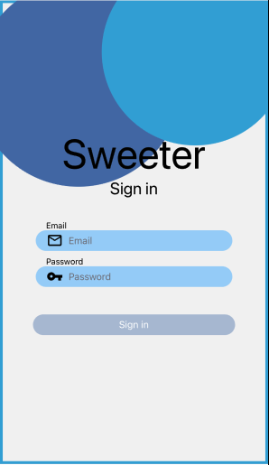
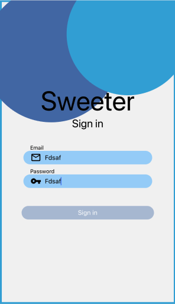

# Ejemplo 02 - Formik para mejorar UX

## Objetivo

- Agregar funcionalidades utiles para cualquier usuario
- Hacer que nuestros formularios sean más controlados

## Desarrollo

Para este ejemplo necesitaremos instalar la librería Yup.

```bash
yarn add yup
```

Podrás ver el código incial completo en el este [link](https://github.com/SantiagoSiordia/ExampleApp/blob/s06-r01/App.tsx).

Agregaremos un nuevo esquema para definir como nos gustaría que los inputs recibieran información. Este esquema puede vivir en cualquier lugar del archivo, pero en este ejemplo lo pondremos justo arriba de la definición del componente `SignInScreen`, en la línea 82.

Pero primero debemos importar Yup.

```ts
import * as Yup from 'yup';
```

El esquema luce de la siguiente manera

```ts
const SigninSchema = Yup.object().shape({
  email: Yup.string() // Que el input sea de tipo string
    .required('Required') // Que no se pueda dejar vacío
    .email('Must be a valid email address'), // Que tenga el formato de un email
  password: Yup.string() // Que el input sea de tipo string
    .min(8, 'Too Short!') // Que no sea menor a 8 caracteres
    .max(25, 'Too Long!') // Que no sea mayor a 25 caracteres
    .match(/[A-Za-z]/, 'Only latin characters') // Que solo se incluyan letras mayúsculas y minúsculas
    .required('Required'), // Que no se pueda dejar vacío
});
```

Podemos intuir del esquema que queremos algunas cosas de cada campo:

- Queremos que el **email** sea un `string` no un `number`, `object` o cualquier otro tipo de dato, es por eso que lo inicializamos con `Yup.string()`. El email no puede dejarse vacío, es por eso que le concatenamos el método `required` de Yup. Tampoco queremos que sea cualquier string, queremos validar que tenga el formato válido de un email, es por eso que le concatenamos también el método `email` de Yup.

- Para el campo **password** queremos que algunas cosas sean similares al de email, por ejemplo queremos que sea un string y que no se pueda dejar vacío. Pero esta vez también queremos que tenga un mínimo y un máximo, por eso agregamos los métodos `min` y `max` de Yup, a estos se les pasa como primer argumento el número que tomarán para validar la longitud del string. Además de todo lo anterior, queremos que cumpla con otros requisitos, por el momento solo queremos que acepte letras de la A a la Z en mayúsculas y minúsculas, si recuerdas tus lecciones de JavaScript puro, recordarás que una expresion regular ó **REGEX** es la forma ideal de limitar patrones para strings.

Ahora queda agregar este esquema de validación a Formik, y lo hacemos de la siguiente manera:

```tsx
const signInForm = useFormik({
  initialValues: {
    email: '',
    password: '',
  },
  onSubmit: values => save('user', values),
  validationSchema: SigninSchema,
});
```

Como podemos ver aquí agregamos el esquema de validación `SigninSchema` asginándoselo a `validationSchema` en el objeto de opciones que le pasamos al hook de `useKormik`.

Ahora si intentas llenar el formulario con datos invalidos, no te dejará hacerle submit a los datos.

¿No sería genial que el usuario supiera si sus inputs son válidos?, también sería una gran idea bloquear el botón de Sign in si algo del formulario no es válido, hagamos esto facilmente con la ayuda de Formik.

Con el objetivo de agregar un poco de lógica de nuevos estilos, vamos a modificar el `SubmitButton` de la siguiente manera:

```tsx
type SubmitButtonProps = TouchableOpacityProps & {
  text: string;
};

const SubmitButton: FC<SubmitButtonProps> = ({ text, ...props }) => {
  return (
    <View style={buttonStyles.container}>
      <TouchableOpacity
        style={StyleSheet.flatten([
          buttonStyles.button,
          {
            backgroundColor: props.disabled
              ? 'rgba(80, 113, 175, 0.4)'
              : 'rgb(80, 113, 175)',
          },
        ])}
        activeOpacity={0.7}
        {...props}>
        <Text style={buttonStyles.text}>{text}</Text>
      </TouchableOpacity>
    </View>
  );
};
```

De tal forma que si a este componente lo renderizamos con el prop `disabled` como `true` o como `false` modifica su color, habiendo hecho esto, podemos eliminar la definición de `backgrounColor` en `buttonStyles.button`, y ahora simplemente nos quedaría así:

```tsx
const buttonStyles = StyleSheet.create({
  button: {
    marginHorizontal: 48,
    height: 30,
    borderRadius: 15,
    alignItems: 'center',
    justifyContent: 'center',
  },
  // Otros estilos
});
```

Ahora podemos modificar el prop `disabled` en el `SubmitButton` que usamos en `SignInScreen`:

```tsx
<SubmitButton
  text="Sign in"
  onPress={signInForm.handleSubmit}
  disabled={!signInForm.isValid} // <---- Agregamos este prop
/>
```

Lo que hará esa nueva línea de código es que cambia el prop `disabled` de `true` a `false` cuando Formik determine que el formulario es válido, con base en el esquema de validación de Yup.

Ahora nuestra pantalla lucirá de la siguiente manera cuando esté vacía:



Aquí se puede notar el cambio de color en el botón.

En la siguiente imagen podemos ver que aunque llenemos los campos, si no es información valida, formik no permite que el botón se habilite, debido a que valida por nosotros la información.



Y en la siguiente imagen podemos ver información válida y podemos ver que el botón se habilita.


Cool, ¿no?