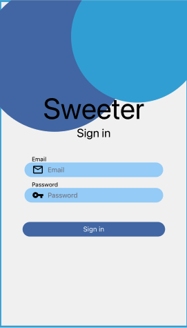
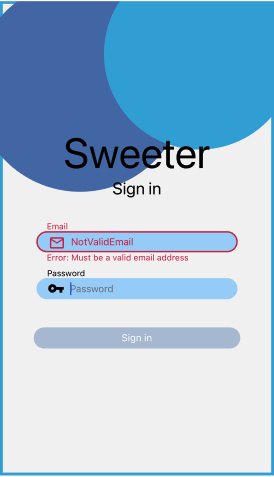
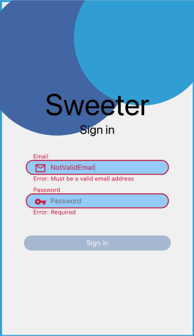
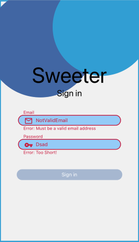
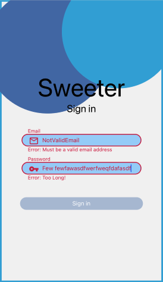
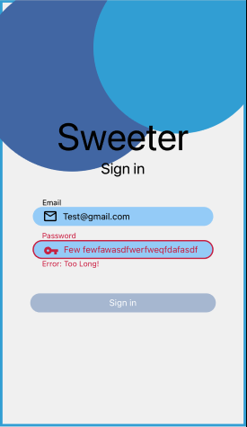
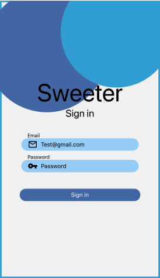

# Ejemplo 03 - Formik para mejorar UX en cada input

## Objetivo

- Explorar utilidades de Formik que no son básicas.
- Hacer que nuestros formularios sean más atractivos para cualquier usuario.

## Desarrollo

Hemos pasado de la barrera de la seguridad ya. Habiendo puesto algo de validación de nuestro lado en el cliente, hemos hecho ya nuestra parte para que el tipo de hackeo "Cross site scripting" sea imposible de realizar.

---

> **¿Qué es el Cross Site Scripting?**
>
> Cross-site scripting (XSS) es una vulnerabilidad de seguridad que permite a un atacante inyectar en un sitio web código malicioso del lado del cliente. Este código es ejecutado por las víctimas y permite a los atacante eludir los controles de acceso y hacerce pasar por usuarios. Según el Open Web Application Security Project, XSS fue la séptima vulnerabilidad más común de las aplicaciones web en 2017.
> 
> Estos ataques tienen éxito si la aplicación web no emplea suficiente validación o codificación. El navegador del usuario no puede detectar que el script malicioso no es confiable, por lo que da acceso a cookies, tokens de sesión u otra información sensible específica del sitio, o permite que el script reescriba contenido HTML.

--- 

El cross site scripting es posible también en nuestras apps móviles ya que React Native usa JavaScript para manejar todo.

Habiendonos relajado un poco de la válidación de entradas en los formularios de nuestras apps, vamos a preocuparnos ahora de avanzar en la experiencia que le podemos ofrecer al usuario.

Para este ejemplo usaremos como estado inicial de nuestro código el archivo [App.tsx de la rama s06-e02](https://github.com/SantiagoSiordia/ExampleApp/blob/s06-e02/App.tsx).

Enfoquémonos en la siguiente parte del archivo:

```tsx
const SignInScreen: FC = () => {
  const SigninSchema = Yup.object().shape({
    email: Yup.string()
      .required('Required')
      .email('Must be a valid email address'),
    password: Yup.string()
      .min(8, 'Too Short!')
      .max(25, 'Too Long!')
      .matches(/[A-Za-z]/, 'Only latin characters')
      .required('Required'),
  });

  const signInForm = useFormik({
    initialValues: {
      email: '',
      password: '',
    },
    onSubmit: values => save('user', values),
    validationSchema: SigninSchema,
  });

  return (
    <View style={styles.container}>
      <Text style={styles.titleText}>Sweeter</Text>
      <Text style={styles.subtitleText}>Sign in</Text>
      <Input
        icon="mail-outline"
        name="Email"
        value={signInForm.values.email}
        onChangeText={signInForm.handleChange('email')}
      />
      <Input
        icon="vpn-key"
        name="Password"
        value={signInForm.values.password}
        onChangeText={signInForm.handleChange('password')}
      />
      <SubmitButton
        text="Sign in"
        onPress={signInForm.handleSubmit}
        disabled={!signInForm.isValid}
      />
      <BackgroundDesign />
    </View>
  );
};
```

Este anterior snippet de código representa el formulario de SignIn.

---

Al código anterior nos gustaría modificarlo de tal manera que podamos darle al usuario una manera de enterarse inmmediatamente que el campo esta llenado de manera incorrecta cuando cambia de campo a otro.

Para cambiar un poco el código de arriba y sin errores, debemos hacer unos cambios importantes en nuestro `Input`. Mira como cambiarán los props, actualmente `InputProps` es:

```tsx
type InputProps = TextInputProps & {
  icon: MaterialIconName;
  name: string;
  placeholder?: string;
};
```

Pero agregaremos dos props más, relacionadas con errores en el campo.

```tsx
type InputProps = TextInputProps & {
  icon: MaterialIconName;
  name: string;
  placeholder?: string;
  error?: boolean;
  errorMessage?: string;
};
```

El prop `error` es un booleano, recordemos que el operador `?` define que no sea requerido. El prop `errorMessage` tampoco es requerido y esta vez representa un string que usaremos para renderizar cuando el campo esté mal llenado.

Ahora veamos el componente `Input`:

```tsx
const Input: FC<InputProps> = ({
  icon,
  name,
  placeholder = null,
  ...props
}) => {
  return (
    <View style={formStyles.container}>
      <Text style={formStyles.label}>{name}</Text>
      <View style={formStyles.inputContainer}>
        <View style={formStyles.iconContainer}>
          <MaterialIcons name={icon} size={24} color="black" />
        </View>
        <TextInput
          style={formStyles.input}
          placeholder={placeholder ?? name}
          placeholderTextColor="#75757F"
          {...props}
        />
      </View>
    </View>
  );
};
```

En este momento luce muy simple, ¡vamos a complicarlo! Todo esto con el objetivo en mente de mejorar la experiencia de usuario mientras hacemos que el código aún sea legible para otros programadores.

```tsx
const Input: FC<InputProps> = ({
  icon,
  name,
  placeholder = null,
  error = false, // Tomamos el prop error y lo igualamos a false si no se define el prop cuando se invoca
  errorMessage, // Tomamos el mensaje de error de los props.
  ...props
}) => {
  return (
    <View style={formStyles.container}>
      <Text
        style={StyleSheet.flatten([ // Agregamos el flatten para combinar dos o más objetos de estilo
          formStyles.label,
          error ? formStyles.errorTextColor : {}, // La variable error definirá que estilo queremos cuando haya un error
        ])}>
        {name}
      </Text>
      <View
        style={StyleSheet.flatten([ // Agregamos el flatten para combinar dos o más objetos de estilo
          formStyles.inputContainer,
          error ? formStyles.inputContainerError : {}, // La variable error definirá que estilo queremos cuando haya un error
        ])}>
        <View style={formStyles.iconContainer}>
          <MaterialIcons
            name={icon}
            size={24}
            color={error ? '#c42348' : 'black'} // La variable error definirá que estilo queremos cuando haya un error
          />
        </View>
        <TextInput
          style={StyleSheet.flatten([ // Agregamos el flatten para combinar dos o más objetos de estilo
            formStyles.input,
            error ? formStyles.errorTextColor : {}, // La variable error definirá que estilo queremos cuando haya un error
          ])}
          placeholder={placeholder ?? name}
          placeholderTextColor="#75757F"
          {...props}
        />
      </View>
      {error && ( // La variable error definirá si renderizamos un texto de error o no
        <Text style={formStyles.errorMessage}>Error: {errorMessage}</Text>
      )}
    </View>
  );
};
```

Hay algunos estilos que no teníamos antes, aquí los puedes ver a detalle: 

```tsx
const formStyles = StyleSheet.create({
  container: {
    marginHorizontal: 48,
    marginBottom: 8,
  },
  label: {
    color: 'black',
    fontSize: 12,
    marginLeft: 15,
  },
  inputContainer: {
    backgroundColor: '#A5D1FA',
    height: 30,
    borderRadius: 15,
    paddingRight: 15,
    justifyContent: 'center',
    flexDirection: 'row',
    width: '100%',
  },
  iconContainer: {
    height: 30,
    width: 40,
    alignItems: 'center',
    justifyContent: 'center',
  },
  input: {
    width: '80%',
  },
  errorMessage: {
    color: '#c42348',
    fontSize: 12,
    marginLeft: 15,
  },
  inputContainerError: {
    borderWidth: 2,
    borderColor: '#c42348',
  },
  errorTextColor: {
    color: '#c42348',
  },
});
```

Habiendo ya modificado nuestro componente input, usemos los nuevos props de estilo que le agregamos. Los activaremos y desactivaremos con lógica que nos provee formik como veremos a continuación. Primero recordemos como lucen nuestros Inputs:

```tsx
<Input
    icon="mail-outline"
    name="Email"
    value={signInForm.values.email}
    onChangeText={signInForm.handleChange('email')}
/>
<Input
    icon="vpn-key"
    name="Password"
    value={signInForm.values.password}
    onChangeText={signInForm.handleChange('password')}
/>
```

A cada uno habrá que agregarle tres propiedades:
- onBlur
- error
- errorMessage

Y los setearemos de la siguiente manera:

```tsx
<Input
    icon="mail-outline"
    name="Email"
    value={signInForm.values.email}
    onChangeText={signInForm.handleChange('email')}
    onBlur={signInForm.handleBlur('email')}
    error={signInForm.touched.email && !!signInForm.errors.email}
    errorMessage={signInForm.errors.email}
/>
<Input
    icon="vpn-key"
    name="Password"
    value={signInForm.values.password}
    onChangeText={signInForm.handleChange('password')}
    onBlur={signInForm.handleBlur('password')}
    error={signInForm.touched.password && !!signInForm.errors.password}
    errorMessage={signInForm.errors.password}
/>
```

El prop `onBlur` recibe una funcíon cuando el evento `Blur` suceda, esto significa que esta función se va a ejecutar cada vez que el usuario cambie el `focus` de ese campo a cualquier otro. Basicamente se activa la función cuando `focus` pasa de `true` a `false`. Y la función está dada por formik, hace muchas cosas esa función, la que nos interesa actualmente es que valida inmediatamente el campo.

El prop `error` fue creado por nosotros, y queremos que sea verdadero solo cuando el campo se haya tocado y formik tenga un error en su memoria de ese mismo campo, es por eso que lo igualamos a `signInForm.touched.password && !!signInForm.errors.password`.

El prop `errorMessage` también fue definido por nosotros, y representa un string que renderizaremos al usuario cuando exista un error, tomemos ventaja de los errores que ya habiamos seteado en el esquema de validación de Yup.

¡Esto fué todo del lado del código!

Si por algún motivo no pudiste seguir la explicación, aquí tienes los dos commits en los que cambiamos el código al estado actual.

1. [Estados de error en ambos inputs del SignInForm](https://github.com/SantiagoSiordia/ExampleApp/commit/54e1a5ab55b294932c65ecb8378e8229984ffd68)
2. [Estilos en sus propios objetos](https://github.com/SantiagoSiordia/ExampleApp/commit/f63481f55cc03bd2945dd88b141b4a005fb81b98)

¿Cómo se ve ahora nuestra App? Veamos

El estado inicial de la app luce de la misma manera, no debió haber cambiado nada, ¿cierto?



Veamos que sucede cuando ingresamos un email invalido esta vez, y después de ingresarlo nos vamos al campo de la contraseña. 



Podemos notar una diferencia obvia, y es algo que esperabamos ¿no?, que si no es válido el email, nos diga de inmediato que no es válido, en vez de que nunca habilite el botón de Sing in.

Lo mismo pasaría si llenamos de manera incorrecta el campo de password o no lo llenamos en absoluto:





Y se compone todo cuando haces lo que se espera que pongas en los inputs.



