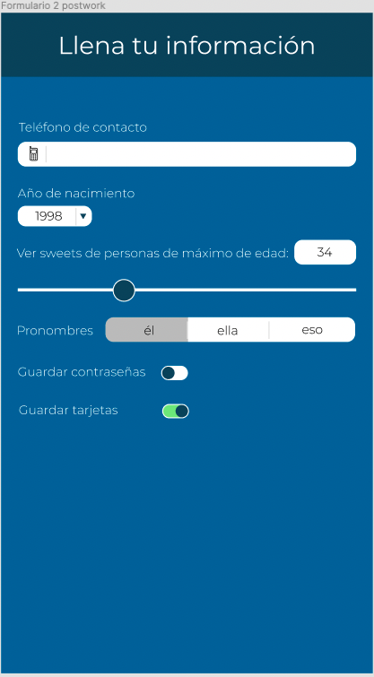

# Sesión 6: Control y validación de entradas

## :dart: Objetivos

- Practicar la creación de formularios
- Crear diferentes tipos de inputs para un formulario en React Native
- Manipular las entradas del usuario

## Desarrollo

- Replicaras las siguientes vistas hechas con Figma:

> Imagen 1 y 2. Vistas de formularios

1. Crea dos formularios con diferentes tipos de entradas para los usuarios. Es muy importante manejar todo el estado con Formik. No se debe usar estado de React para manejar ninguna de estas variables.

El diseño no tiene que lucir igual pero tiene que gustarte a ti. Recuerda que no es obligatorio seguir nuestros diseños, son solo una sugerencia de estilos por si no te quieres preocupar mucho por diseñar.

2. La imagen 1 muestra un formulario de “Login” de tu app sweeter. Si elegiste otra cambia el nombre, pon el logo si has hecho uno. Lo importante aquí es la funcionalidad de los formularios. Esto también aplica para la imagen 2.

3. Se pusieron varios ejemplos de diferentes tipos de entradas, todos estos tipos de entradas deben existir en tu app, aunque no pregunten exactamente lo mismo. Ejemplo: El año de nacimiento puede ser cambiado por país de residencia, siempre y cuando la manera de elegir el valor sea el mismo: un dropdown menu.

No es necesario que el botón de “Ingresar con Google” haga algo.

4. El botón ingresar sí debería comunicarle de alguna manera al usuario que ya se ha logueado correctamente o incorrectamente, según sea el caso. Puedes crear tu propio diseño de UI para eso.

Puedes crear tus propios componentes o puedes usar paquetes de terceros.
