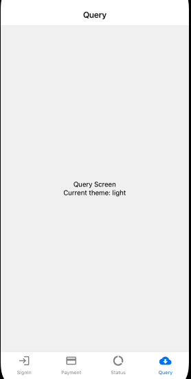

# Ejemplo 02 - React redux y estado global

## Objetivo

- Comprender de manera experimental que es un estado global.
- Descartar Redux para manejar estado del servidor.

## Desarrollo

En esta oportunidad, crearemos un poco de código nuevo en nuestra app. Toma en cuenta que el estado inicial de esta app se encuentra en este [link](https://github.com/SantiagoSiordia/ExampleApp/tree/s07-e01).

### Creando una nueva pantalla

Practiquemos crear una nueva pantalla, esta pantalla se usará para mostrar los datos de React Query:

```bash
touch src/screens/QueryScreen.tsx
```

Y agregamos a `src/screens/index.ts` la exportación de la nueva pantalla:

```ts
export * from './PaymentScreen';
export * from './QueryScreen';
export * from './SignInScreen';
export * from './StatusScreen';
```

Agregamos el componente (que aún no está hecho) a la navegación de tabs en `App.tsx`:

```tsx
<Tab.Screen
    name="Query"
    component={QueryScreen}
    options={{
    tabBarIcon: ({ color, size }) => (
        <MaterialIcons name="cloud-download" color={color} size={size} />
    ),
    }}
/>
```

Y lo único que nos queda es hacer el componente de la pantalla en `src/screens/QueryScreen.tsx`:

```tsx
import React, { FC } from 'react';
import { StyleSheet, Text, View } from 'react-native';

export const QueryScreen: FC = () => {
  return (
    <View style={styles.container}>
      <Text>Query Screen</Text>
    </View>
  );
};

const styles = StyleSheet.create({
  container: {
    width: '100%',
    height: '100%',
    justifyContent: 'center',
    alignItems: 'center',
  },
});
```

Agregaremos la lógica necesaria para consumir el `theme` que guardamos en redux. Así que envolvamos la a `App.tsx` en el Provider de Redux.

```tsx
import { MaterialIcons } from '@expo/vector-icons';
import { createBottomTabNavigator } from '@react-navigation/bottom-tabs';
import { NavigationContainer } from '@react-navigation/native';
import React, { FC } from 'react';
import { Provider } from 'react-redux';
import {
  PaymentScreen,
  QueryScreen,
  SignInScreen,
  StatusScreen,
  store,
} from './src';

const Tab = createBottomTabNavigator();

const App: FC = () => {
  return (
    <Provider store={store}>
      <NavigationContainer>
        <Tab.Navigator>
          <Tab.Screen
            name="SignIn"
            component={SignInScreen}
            options={{
              tabBarIcon: ({ color, size }) => (
                <MaterialIcons name="login" color={color} size={size} />
              ),
            }}
          />
          <Tab.Screen
            name="Payment"
            component={PaymentScreen}
            options={{
              tabBarIcon: ({ color, size }) => (
                <MaterialIcons name="payment" color={color} size={size} />
              ),
            }}
          />
          <Tab.Screen
            name="Status"
            component={StatusScreen}
            options={{
              tabBarIcon: ({ color, size }) => (
                <MaterialIcons name="data-usage" color={color} size={size} />
              ),
              unmountOnBlur: true,
            }}
          />
          <Tab.Screen
            name="Query"
            component={QueryScreen}
            options={{
              tabBarIcon: ({ color, size }) => (
                <MaterialIcons
                  name="cloud-download"
                  color={color}
                  size={size}
                />
              ),
            }}
          />
        </Tab.Navigator>
      </NavigationContainer>
    </Provider>
  );
};

export default App;
```

Y cambiemos también un poco la manera en que creamos nuestra store:

```ts
import { combineReducers, configureStore } from '@reduxjs/toolkit';
import { createSelectorHook } from 'react-redux';
import { preferencesSlice } from './preferences';

const rootReducer = combineReducers({
  preferences: preferencesSlice.reducer,
});

export const store = configureStore({
  reducer: rootReducer,
});

export const useAppSelector = createSelectorHook<RootState>();
export type RootState = ReturnType<typeof rootReducer>;
```

Esto para permitirnos tener más reductores en el futuro si así lo decidimos.

Y finalmente modifiquemos `src/screens/QueryScreen.tsx` de la siguiente manera:

```tsx
import React, { FC } from 'react';
import { StyleSheet, Text, View } from 'react-native';
import { useAppSelector } from '..';

export const QueryScreen: FC = () => {
  const theme = useAppSelector(state => state.preferences.theme);

  return (
    <View style={styles.container}>
      <Text>Query Screen</Text>
      <Text>Current theme: {theme}</Text>
    </View>
  );
};

const styles = StyleSheet.create({
  container: {
    width: '100%',
    height: '100%',
    justifyContent: 'center',
    alignItems: 'center',
  },
});
```

Cuando corremos la app en este estado, podemos ver que luce de la siguiente manera:



¡Muestra el tema actual de la app! Eso es todo.

Estaría cool que pudieramos cambiarlo con presionar un botón, por suerte para nosotros, sí se puede, agregaremos nuestro componente `SubmitButton` a la pantalla:

```tsx
<SubmitButton text="Toggle theme" onPress={handleToggleTheme} />
```

Esa función que está dentro del `onPress` habrá que definirla, importemos `useDispatch` de `react-redux`:

```ts
import { useDispatch } from 'react-redux';
```

Y creamos nuestra función.

```ts
const dispatch = useDispatch();
const handleToggleTheme = () => dispatch(toggleTheme());
```

Después de haber hecho eso, podemos ver en el siguiente video