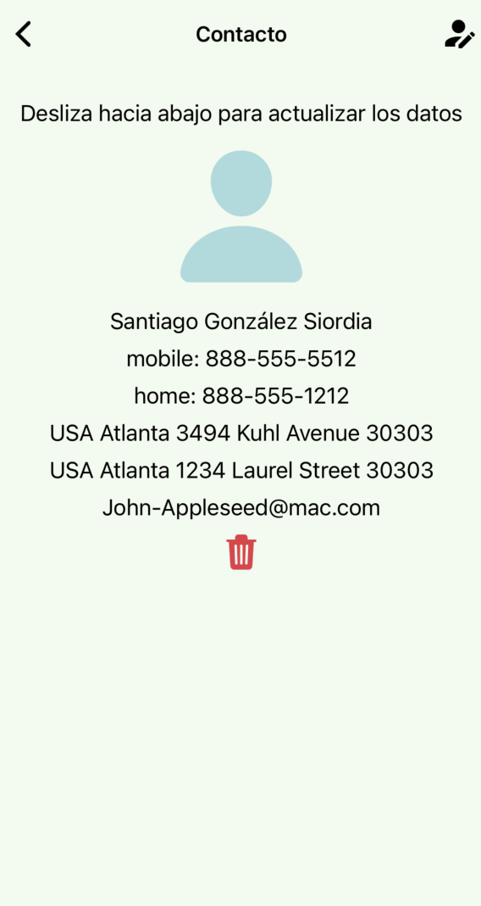
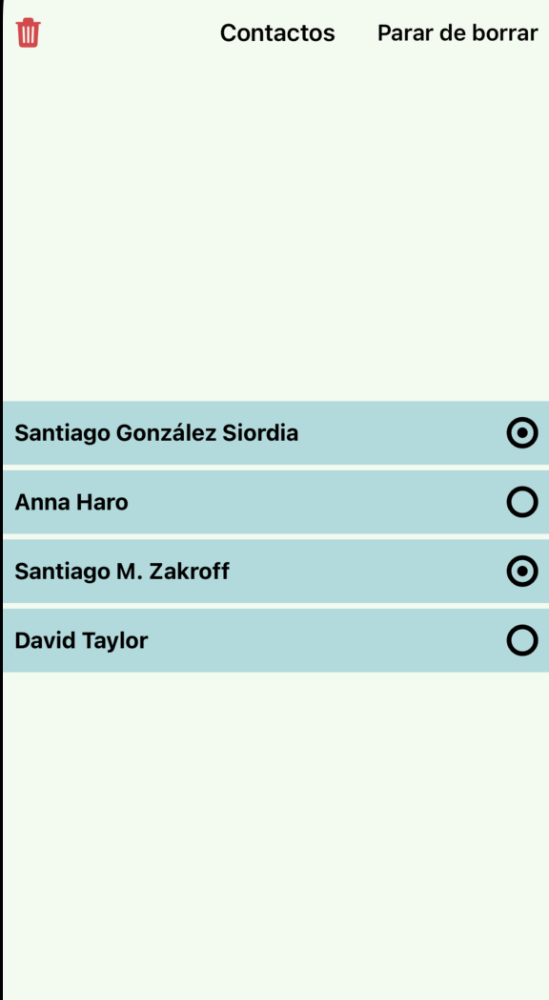
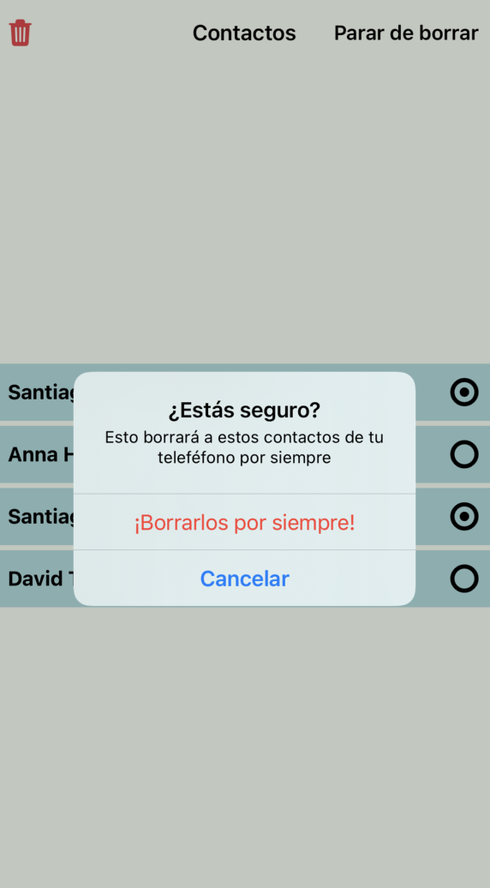
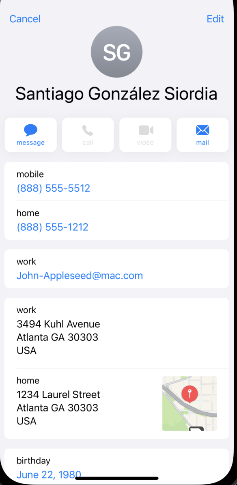
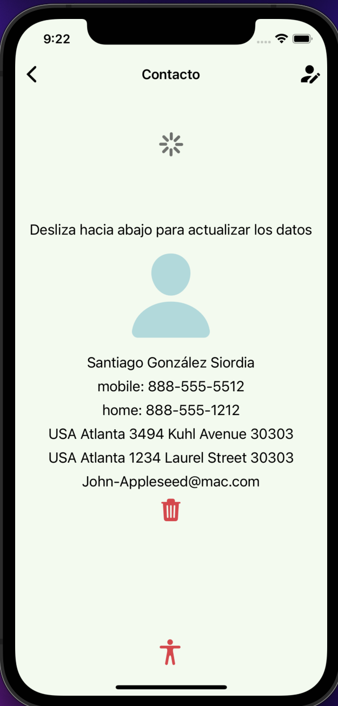

# Sesión 7: Consumo de APIs

## :dart: Objetivos

- Practicar conocimientos de React Query.
- Consumir APIs de manera segura y eficiente.

## Desarrollo

1. Instala expo-contact y React query en tu proyecto.
2. Crea tus propios hooks, funciones de fetching asíncronas y tu propia manera de consumir las respuestas de nuestro servidor.
3. Crea dos pantallas más para tu app, aquí te presentamos las sugerencias para ellas:
Esta vez está prohibido seguir la UI de esta app. Crea tu propia UI, no es necesario usar íconos, aunque puedes hacerlo para practicar tus habilidades.

> Imagen 1 y 2. Pantallas que tenemos que agregar a nuestra app

Estas pantallas tienen como objetivo consumir desde el teléfono los contactos que se tienen guardados, los despliega en una lista en la primera pantalla, en esta pantalla también se pueden borrar los contactos seleccionandolos después de presionar el botón borrar. Aquí una imagen de ejemplo

> Imagen 3. Primera pantalla habiendo seleccionado “borrar”.

Antes de borrar los contactos aparece un modal nativo del teléfono como lo muestra la siguiente imagen:

> Imagen 4. Mensaje de confirmación antes de borrar contactos en la primera pantalla.

4. Para la segunda pantalla, debemos entender que es la vista individual de cada contacto. Debes ayudarte de la API de expo-contacts para estas pantallas.
En la pantalla 2, que pertenece a la imagen 2, puedes editar el contacto cuando presionas en editar, te redirige a la pantalla nativa de cada sistema operativo para editar el contacto, como podrás apreciar en la siguiente imagen:

> Imagen 5. Edición de contactos en app nativa del sistema operativo.

5. Después de actualizarse el contacto en el teléfono la app no se actualizará inmediatamente, debe de deslizarse hacia abajo o puedes utilizar cualquier otra sencilla manera para activar el actualizado de datos

> Imagen 6. Pantalla actualizando.

6. Para consumir la API de expo-contact deberás también apoyarte de la librería React Query, para aprovechar las bondades que esta librería trae al fetchear datos de manera asíncrona.
