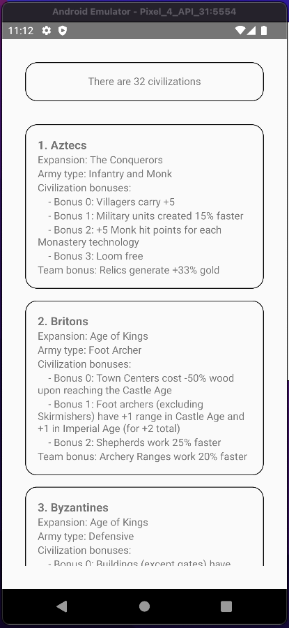

# Solución

Aquí planteamos una solución utilizando la [API pública de Age of Empires II](https://age-of-empires-2-api.herokuapp.com/docs/).

Después de crear la app con 

```bash
npx react-native init AgeOfEmpires --template react-native-template-typescript
```

Agregamos react query y axios para hacer la lógica de fetching

```bash
yarn add react-query axios
```

Importamos todas las herramientas que usaremos en `App.tsx`:

```tsx
import axios from 'axios';
import React, { FC } from 'react';
import { FlatList, ListRenderItem, StyleSheet, Text, View } from 'react-native';
import { QueryClient, QueryClientProvider, useQuery } from 'react-query';
```

También modificamos el export default:

```tsx
const queryClient = new QueryClient();

export default () => (
  <QueryClientProvider client={queryClient}>
    <App />
  </QueryClientProvider>
);
```

Ya que vamos a usar la API de Age of empires, valdrá la pena crear las interfaces correspondientes:

```ts
interface Civilization {
  id: number;
  name: string;
  expansion: string;
  army_type: string;
  unique_unit: Array<string>;
  unique_tech: Array<string>;
  team_bonus: string;
  civilization_bonus: Array<string>;
}

interface CivilizationResponse {
  civilizations: Array<Civilization>;
}
```

Y teniendo las interfaces podremos crear la lógica de fetcheado en una función:

```ts
const fetchCivilizations = async () => {
  const { data } = await axios.get<CivilizationResponse>(
    'https://age-of-empires-2-api.herokuapp.com/api/v1/civilizations',
  );
  return data;
};
```

Y envolver la lógica de fetcheado en el conveniente hook de react query `useQuery`:

```ts
const useCivilizations = () => useQuery('civilizations', fetchCivilizations);
```

Esta app consiste en renderizar cartitas de todas las civilizaciones de Age of Empires II, así que creamos un componente para este fin:

```tsx
const renderCivilization: ListRenderItem<Civilization> = ({ item }) => {
  return (
    <View style={civilizationStyles.civilizationContainer}>
      <Text style={civilizationStyles.title}>
        {item.id}. {item.name}
      </Text>
      <Text style={civilizationStyles.details}>
        Expansion: {item.expansion}
      </Text>
      <Text style={civilizationStyles.details}>
        Army type: {item.army_type}
      </Text>
      <Text style={civilizationStyles.details}>Civilization bonuses:</Text>
      {item.civilization_bonus.map((bonus, index) => {
        return (
          <Text key={bonus} style={civilizationStyles.details}>
            {'    '}- Bonus {index}: {bonus}
          </Text>
        );
      })}
      <Text style={civilizationStyles.details}>
        Team bonus: {item.team_bonus}
      </Text>
    </View>
  );
};

const civilizationStyles = StyleSheet.create({
  civilizationContainer: {
    width: '100%',
    flex: 1,
    borderRadius: 16,
    padding: 16,
    borderWidth: 1,
    borderColor: 'black',
    marginBottom: 16,
  },
  title: {
    fontSize: 16,
    fontWeight: 'bold',
  },
  details: {
    fontSize: 14,
  },
});
```

Y nuestro componente app solo tendrá un título de cuantas civilizaciones existen seguido de un FlatList que renderiza nuestras cartas de civilización, incluidos sus respectivos estilos:

```tsx
const App: FC = () => {
  const { data: civilizationsData, isLoading, isError } = useCivilizations();

  if (isLoading) {
    return <Text>Is loading</Text>;
  }

  if (isError) {
    return <Text>Is error</Text>;
  }

  const { civilizations } = civilizationsData || { civilizations: [] };

  return (
    <View style={styles.container}>
      <Text style={styles.text}>
        There are {civilizations.length} civilizations
      </Text>
      <FlatList
        data={civilizations}
        renderItem={renderCivilization}
        showsVerticalScrollIndicator={false}
      />
    </View>
  );
};

const styles = StyleSheet.create({
  container: {
    height: '100%',
    width: '100%',
    padding: 32,
  },
  text: {
    marginBottom: 32,
    textAlign: 'center',
    borderRadius: 16,
    padding: 16,
    borderWidth: 1,
    borderColor: 'black',
  },
});
```

De tal manera que ahora nuestra app se debe ver de la siguiente forma:



Y aquí podemos ver un vídeo de como se ve la app cuando scrolleas hacia abajo.


## Conclusión

Podemos ver lo sencillo que es consumir datos asíncronos gracias a la lógica que implementa React query por nosotros, ¿Te diste cuenta de la pantalla de carga? No tuvimos que hacer nada de lógica más allá de un simple `if`. Genial, ¿no?