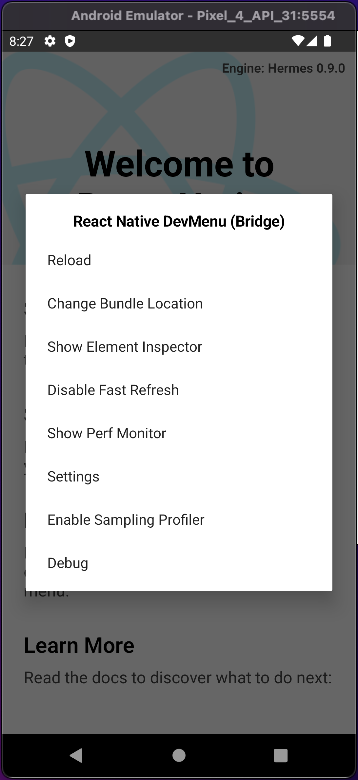
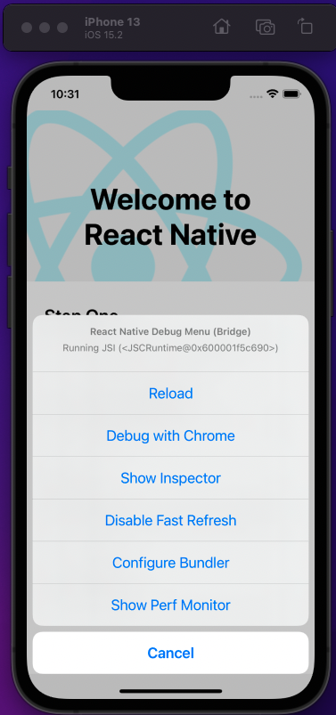
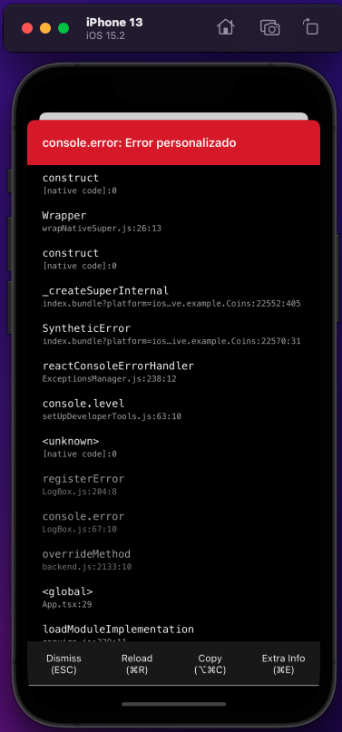
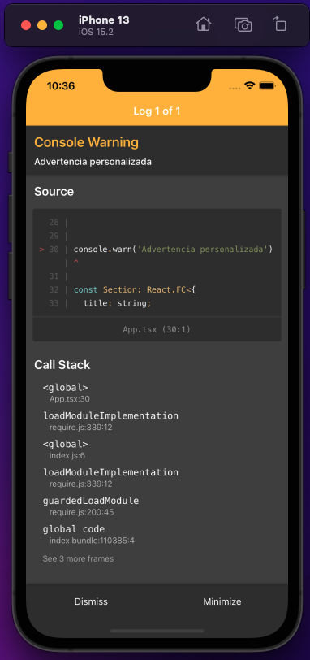

# Ejemplo 01 - Debugging en React Native

## Objetivo

- Entender todas las herramientas que ya vienen en React Native preinstaladas
- Usar estas herramientas en favor del correcto desarrollo de apps.

## Desarrollo

**Acceder al menú de desarrollo In-App**

Se puede acceder al menú del desarrollador "agitando" el dispositivo o seleccionando `Shake Gesture` dentro del menú Hardware en el simulador de iOS. También puede utilizar el <span style="color:red;">⌘D</span> cuando la aplicación se está ejecutando en el simulador de iOS, o <span style="color:red;">⌘M</span> cuando se ejecuta en un emulador de <span style="color:green;">Android</span> en Mac OS y <span style="color:blue;">Ctrl+M</span> en Windows y Linux. Alternativamente para <span style="color:green;">Android</span>, puede ejecutar el siguiente comando:

```bash
adb shell input keyevent 82
```

para abrir el menú de desarrollo (ya que 82 es el código de la tecla `Menú`).

Aquí podemos ver el resultado de todo esto:




> Este DevMenu está descativado en las versiones de producción.

**Errores y advertencias**

Los **errores** en la aplicación se muestran en una alerta de pantalla completa con un fondo rojo dentro de su aplicación. Esta pantalla se conoce como **RedBox**. Puede usar `console.error()` para activar uno manualmente.



Las **advertencias** se mostrarán en la pantalla con un fondo amarillo. Éstas alertas se conocen como `YellowBoxes`. Se puede hacer clic en ellas para obtener más información de la misma:




Al igual que con **RedBox**, puedes usar `console.warn()` para activar un `YellowBox`.

Los `YellowBoxes` pueden desactivarse durante el desarrollo escribiendo:

```TSX
console.disableYellowBox = true;
```

Las advertencias específicas se pueden ignorar mediante programación estableciendo una matriz de prefijos que deben ignorarse:

```TSX
import { YellowBox } from 'react-native';

YellowBox.ignoreWarnings(['Warning: ...']);
```

> Los RedBoxes y los YellowBoxes se desactivan automáticamente en las construcciones de lanzamiento (producción).

**Inspector de React Native**

El inspector es a veces una herramienta muy útil. Puedes usarlo al abrir el DevMenu y seleccionando "Show Inspector". Mostrará un overlay ehn donde puedes presionar sobre cualquier elemento de la UI para obtener información de él. 

AQUÍ VA EL VIDEO DE EL REACT NATIVE INSPECTOR!!!!!!!!!!!!!!!!!!!!!!!!!!!

