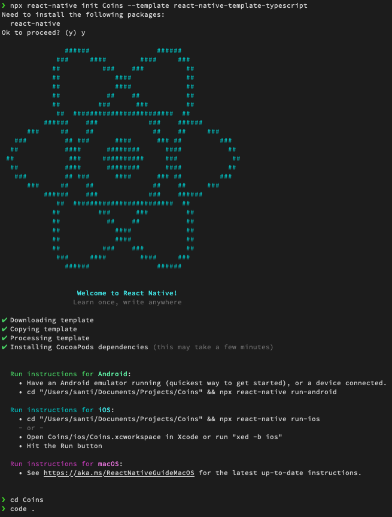
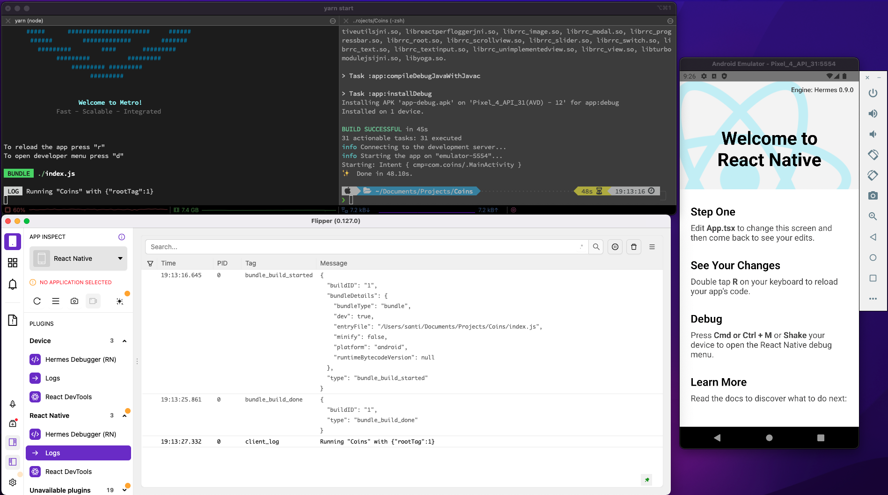
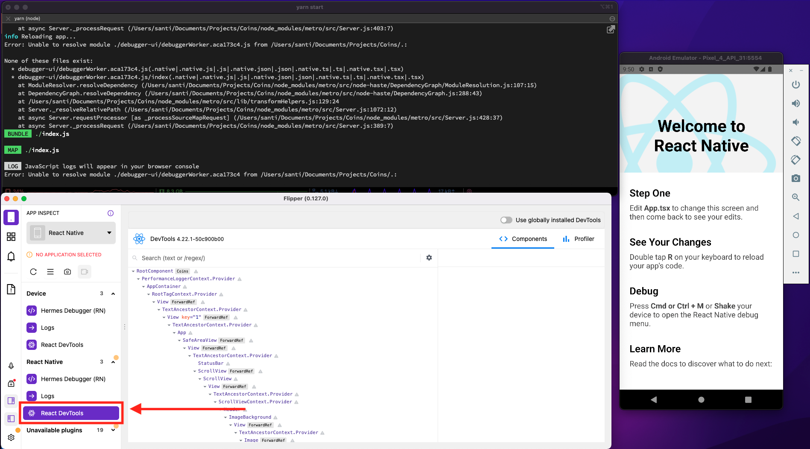

# Ejemplo 02 - Flipper

## Objetivo

- Instalar Flipper
- Experimentar como debuggear la app de manera más sencilla

## Desarrollo

Después de haber instalado Flipper. Podemos empezar una demotración de como funciona.

Vamos a crear una nueva app para debuggear y desarrollar más rápido con flipper, para este momento, tenemos muy claro como empezar una app, ¿Cierto?:

```bash
npx react-native init Coins --template react-native-template-typescript
```



Habilitemos `hermes` en `android/app/build.gradle`:

```gradle
project.ext.react = [
    enableHermes: true,  // clean and rebuild if changing
]
```

Ahora podemos correr la app en Android:

```bash
yarn android
```

Podemos ver inmediatamente muchos los logs de la app.



Una vez que varamos al árbol de componentes podemos ver algo muy similar o igual a esto:



Si tenemos problemas conectando el árbol en Android, debería servirnos correr el comando

```bash
adb reverse tcp:8097 tcp:8097
```

No siempre tendremos a un maestro junto a nosotros, deberíamos decirte que ese comando puede ser encontrado si se busca el error que sale en Flipper cuando no funciona algo bien, ese mismo comando se pudo haber sacado de [este comentario en un thread de issues de Github](https://github.com/facebook/flipper/issues/1000#issuecomment-617512233).

Inspeccionemos todos los componentes que hay por ahí.

