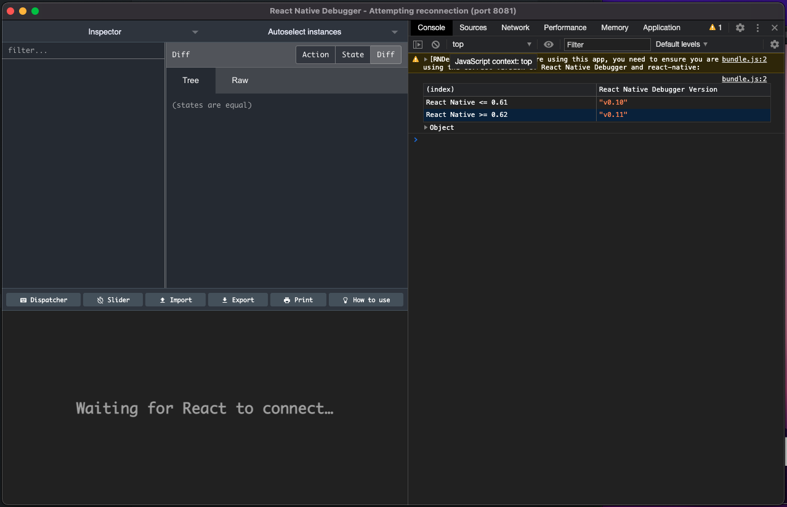
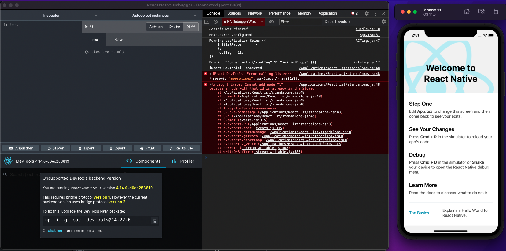
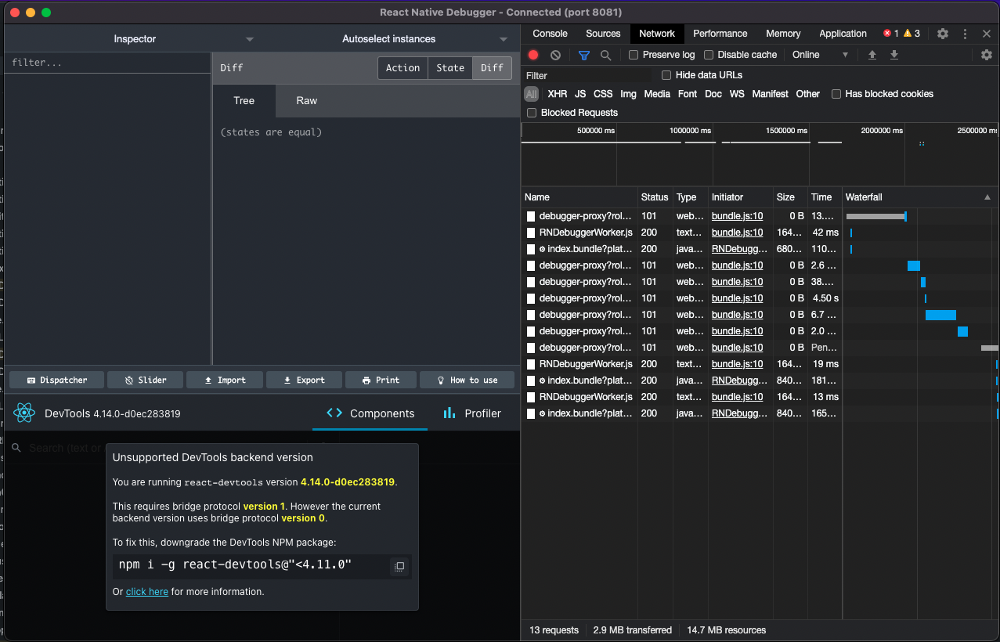
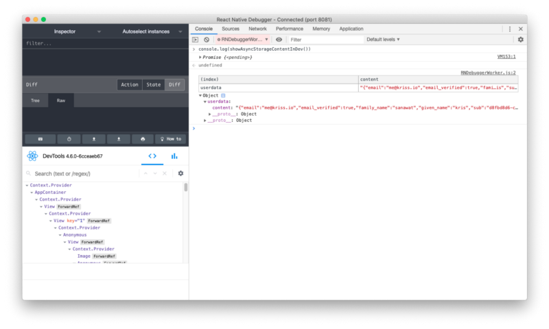
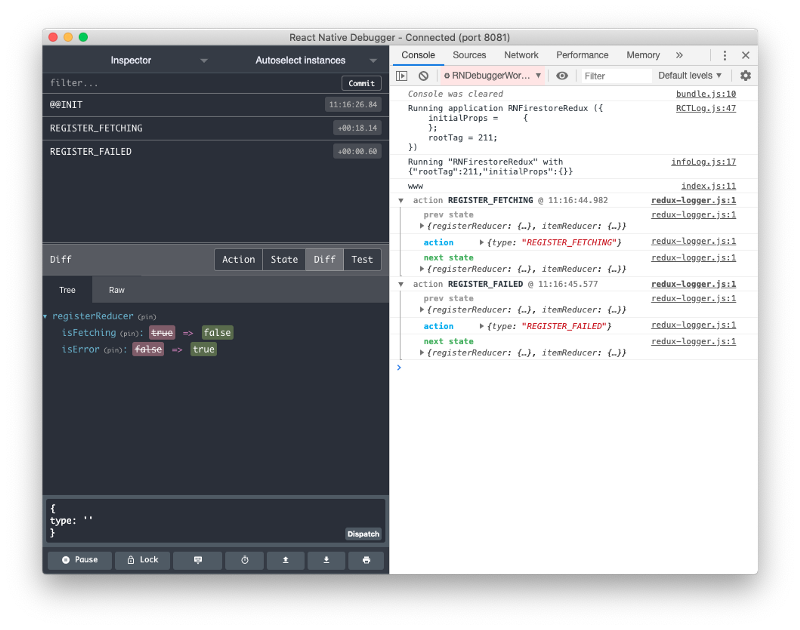

# Ejemplo 3 - React native debugger

## Objetivo

- Juzgar las habilidades de React native debugger.
- Deducir cuando usar React native debugger vs otros.

## Desarrollo

Después de una instalación exitosa, podemos simplemente abrir React native debugger. De tal manera que veremos el estatus de reconexión en la barra de título de la ventana del debugger. El proceso del debuggeo será ejecutado en el puerto 8081:



Ahora cuando corramos la app en modo debug, ya no tenemos necesidad de abrir un navegador. Para tener una app de react native en modo debug, simplemente tenemos que sacar el `DevMenu` y activar el `Debug Mode`.

Una vez que la app ya esté en modo debug, con el debugger ya abierto, vamos a poder apreciar que la app se conecta al debugger en vez de Chrome Dev Tools. Todos los logs de consola y opciones de debuggeo van a aparecer en la app como podemos ver en la siguiente imagen:



A partir de aquí podemos usar la pestañas a la derecha de una manera muy similar a la manera en que debuggeamos apps en la web. Por ejemplo, en la pestaña de `Console` podemos ver los logs de la consola, que normalmente aparecerian en la terminal que actua como `Metro Bundler`.

### Inspector de Red

Cuando desarrollamos una app que necesita conectarse a un servidor, en general, podemos no saber que está pasando detrás de cámaras, Por ejemplo, cuando estamos mandando requests al servidor, puede ser dificil llevar el registro de un error si ocurre. Los desarrolladores usualmente debuggeamos esto al imprimir o alertar mensajes de error, pero esto toma extremadamente mucho tiempo.

Así que con la ayuda de RNDebugger, podemos facilmente monitorear todas las peticiones entrantes o salientes entre la app y el servidor.

- Podemos monitorear componentes de React, store de Redux, también actividad de red dentro de la misma ventana.
- Podemos modificar CORS mientras la app está corriendo.
- Podemos modificar la configuración del header de la petición, como los nombres, el origen, el user-agent. Nos permite controlar TODO de una petición de red.



### Manejo de Async Storage

Podemos debuggear también la configuracion usando el React Native Debugger. Podemos simplemente loggearlo a la consola usando la siguiente linea de código:

```TS
console.log(showAsyncStorageContentInDev())
```

Una vez que agregamos esta línea al código podemos ver el siguiente resultado en la ventana de la consola.



### Debuggeando estado de Redux y acciones

Como se menciona en la documentación oficial, RND ya tiene una poderosa herramienta para el desarrollo de Redux, los devtools de redux no funcionarán bien al menos que explicitamente activemos lode devtools de redux en nuestra app. Para usar redux devtool en RND, necesitamos activar redux en nuestra app al agregar algunas líneas de configuración a `App.tsx`.

```TS
const composeEnhancers = window.__REDUX_DEVTOOLS_EXTENSION_COMPOSE__ || compose;
const store = createStore(reducers, composeEnhancers(middlewares));
```



