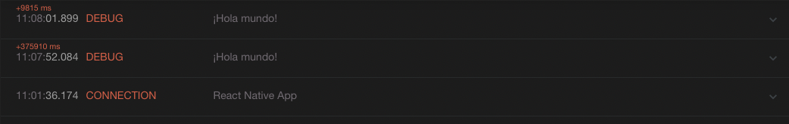
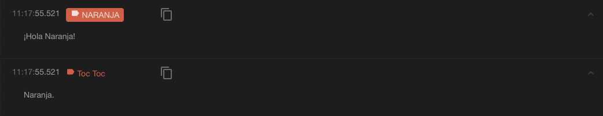

# Ejemplo 4 - Reactotron

## Objetivo

- Aprender a usar Reactotron en cualquier proyecto
- Aprovechar las ventajas de usar Reactotron

## Desarrollo

Deberemos instalar localmente Reactotron en el proyecto.

```bash
yarn add -D reactotron-react-native
```

Siempre es bueno tener un archivo de configuración para cada feature.

Por ejemplo `ReactotronConfig.js`, podriamos ponerlo en cualquier lugar del proyecto.

```JS
import Reactotron from 'reactotron-react-native'

Reactotron
  .setAsyncStorageHandler(AsyncStorage)
  .configure()
  .useReactNative()
  .connect()
```

Una manera más avanzada de personalizar cuáles plugins incluir puede ser la siguiente:

```JS
import Reactotron from 'reactotron-react-native'

Reactotron
  .setAsyncStorageHandler(AsyncStorage)
  .configure({
    name: "React Native Demo"
  })
  .useReactNative({
    asyncStorage: false,
    networking: {
      ignoreUrls: /symbolicate/
    },
    editor: false,
    errors: { veto: (stackFrame) => false },
    overlay: false,
  })
  .connect();
```

También podemos crear nuestro propio plugin, nuestro `middleware`:

```JS
import Reactotron from 'reactotron-react-native'

const middleware = (tron) => { /* plugin definition */ };

Reactotron
  .setAsyncStorageHandler(AsyncStorage)
  .configure({
    name: "React Native Demo"
  })
  .useReactNative()
  .use(middleware)
  .connect();
```

Y finalmente tendríamos que modificar nuestra `App.tsx` o nuestro `index.js` con las siguientes líneas:

```TSX
if(__DEV__) {
  import('./ReactotronConfig').then(() => console.log('Reactotron Configured'))
}
```

Para este momento Reactotron debería estar funcionando. La consola debería loggear un mensaje como el siguiente: `Reactotron Configured`


Para que funcione en Android tendríamos que correr el comando:

```bash
adb reverse tcp:9090 tcp:9090
```


### Hola mundo en Reactotron!

Podríamos abrir el archivo `App.tsx`, importar Reactotron y loggear un mensaje:

```TSX
import Reactotron from 'reactotron-react-native'

Reactotron.log('¡Hola mundo!')
```

Habrá que recargar la app y ver en Reactotron el resultado:



Con `Reactotron.warn()` se manda un warning:


Con `Reactotron.error()` se manda un error:


También podemos perzonalizar logs:

```TSX
Reactotron.display({
  name: 'Toc Toc',
  preview: '¿Quién es?',
  value: 'Naranja.',
});

Reactotron.display({
  name: 'NARANJA',
  preview: '¿Quién?',
  value: '¡Hola Naranja!',
  important: true,
});
```



Pero para este momento parece que solo parece que es una versión muy complicada de `console.log()`.

Veamos el siguiente repositorio: https://github.com/SantiagoSiordia/demo-reactotron

En este repositorio encontraremos después del proceso de instalación y construcción de la app la siguiente pantalla inicial:


Reactotron empieza a ser muy útil cuando usamos [Redux](https://redux.js.org/).

Deberíamos correr:

```
yarn add -D reactotron-redux
```

Con esto podemos:

- Llevar un registro de cuando las acciones son despachadas
- Suscribirse a cambios en el árbol de estados
- Ver valores a voluntad
- Despachar acciones desde Reactotron
- Reproducir acciones
- Cambiar el estado de la aplicación mientras la app corre.

Presionemos los botones que esta app nos provee, y veamos el resultado en Reactotron!

¡Discutamos entre todos los resultados de estos botones y logs en Reactotron!