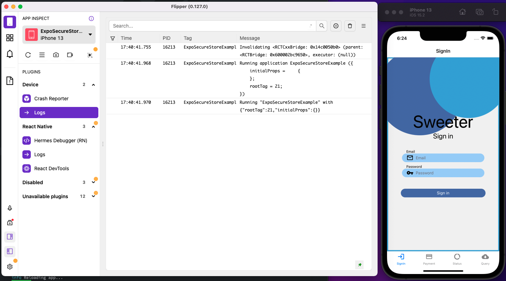
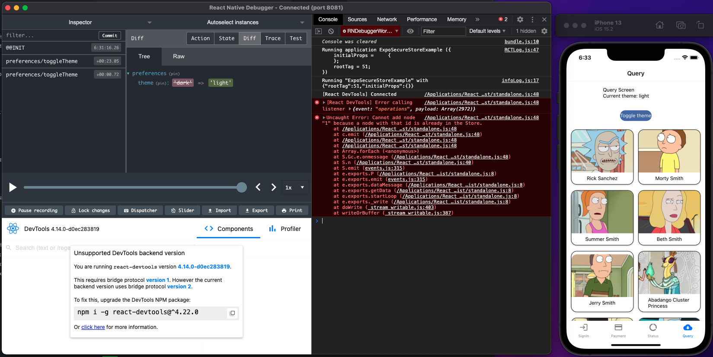
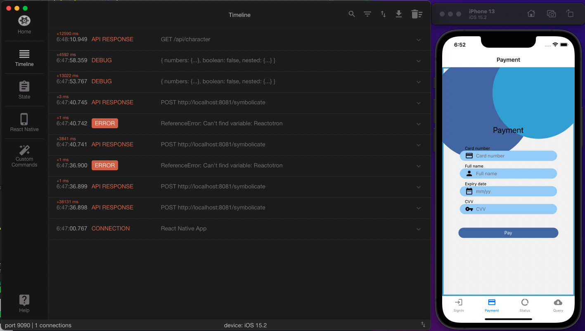

# Sesión 8: Debuggeando apps con react native

## :dart: Objetivos

- Experimentar con las tres herramientas de debuggeo revisadas.
- Detectar posibles errores en las apps creadas por otros desarrolladores.

## Desarrollo

En este postwork experimentarás debuggear apps usando estas nuevas herramientas: Flipper, Reactotron y React Native debugger.

Revisarás las apps de tus compañeros, descargarás sus repositorios y arreglarás tus entornos locales para correrlos. Recuerda que tendrás que clonar los repositorios e instalar las librerías necesarias corriendo “yarn”. Conecta cada una de las herramientas, pero no simultáneamente.

1. Revisa el ejemplo que aquí se encuentra, donde se muestra que puedes buscar en cada una de las apps de tus compañeros. Usarás la app que hemos estado creando en las anteriores sesiones, e instalarás algunos plugins en flipper.

> Imagen 1. Flipper en app de react native

2. Intenta encontrar el estado de Redux, de React-query, de Async-Storage y del secure-store. Toma capturas de pantalla de todos esos y además, si encuentras un error en un estado en particular, habrá que tomarle captura de pantalla también

> Imagen 2. Debuggeando app con react native debugger

3. En el React native debugger solo tomarás capturas de pantalla de árbol de componentes de las diferentes pantallas de tus compañeros.

> Imagen 3. Reactotron

4. Para esta herramienta deberás tomar captura de pantalla de todos los tipos de estado que Reactotrón ofrece.

5. Todas las capturas de pantalla deberán incluir un simulador o emulador al lado.
