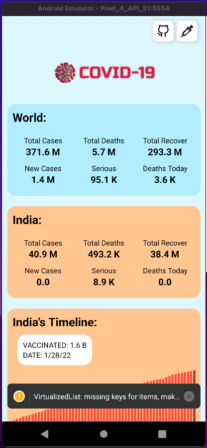
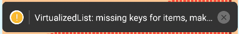

# Solución

Para esta solución, hemos elegido instalar y analizar la app de [Covid19](https://github.com/sarthakpranesh/Covid19).

Así que correremos el comando necesario para clonar el repositorio:

```bash
git clone git@github.com:sarthakpranesh/Covid19.git
```

Esta es una app bastante pesada, así que es normal que tarde algunos minutos en clonarse.

Dentro de la carpeta del proyecto debemos instalar los módulos de node con `yarn`.

```bash
yarn && yarn android
```

de tal manera que nuestra app se verá de la siguiente forma:


> Image 1: Landing page de la app Covid19

Podemos notar desde el principio que hacen falta keys en algunas listas, debido al warning que nos aparece al principio:


> Imagen 2: Warning en la pantalla inicial

Con esto ya encontramos desde un principio una forma de optimizar la app. Deberíamos buscar TODAS las listas, incluyendo `map`s y `reduce`s que puedan existir en cualquier parte del código.

Algunos proyecto no son compatibles con todos los debuggers, con suerte podrás conectar alguno de ellos solamente. Sin suerte, nos tenemos que quedar con el React Native Inspector. Y así es en los proyetos de alguna compañia, hay ocasiones en las que es más importante mantener el soporte de las librerías en producción que dedicar tiempo para mantener la compatibilidad entre los debuggers y la app para que los desarrolladores puedan hacer las cosas más rápido. Ya que este es un proyecto de expo


